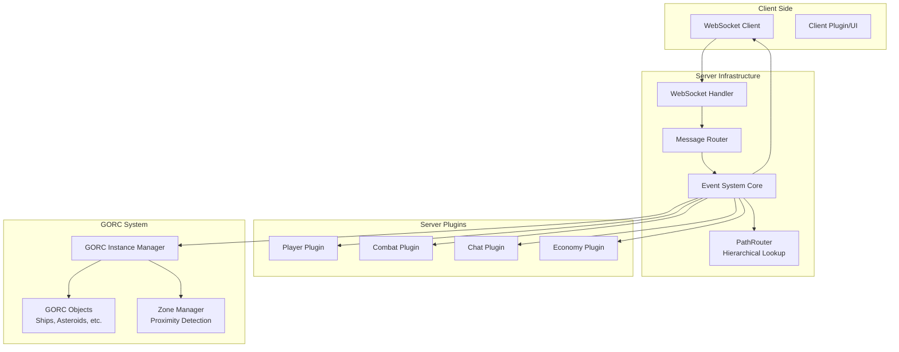
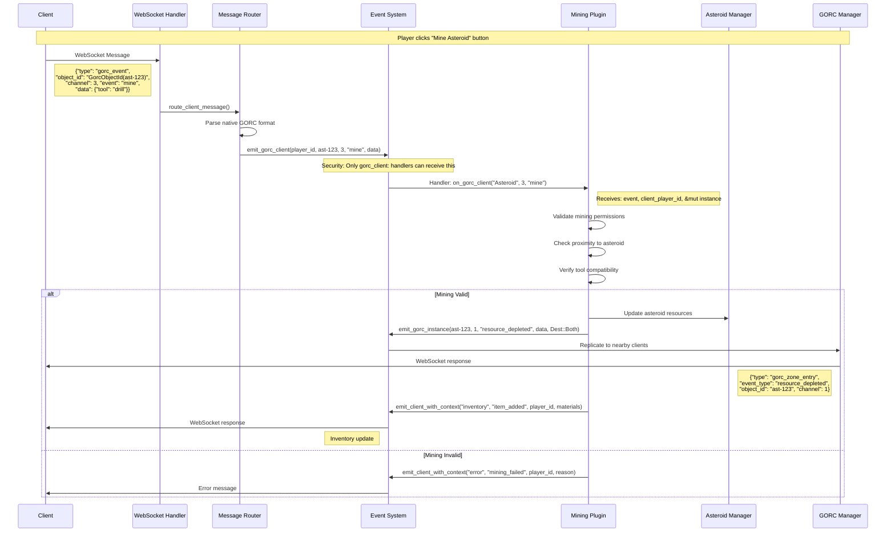
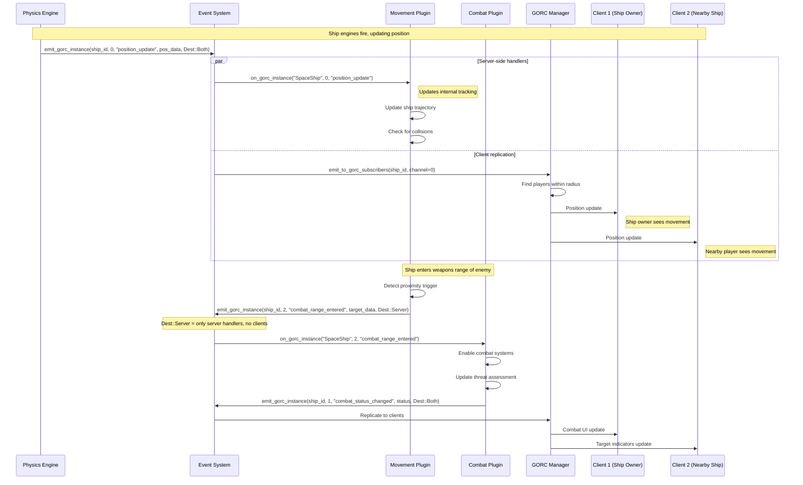
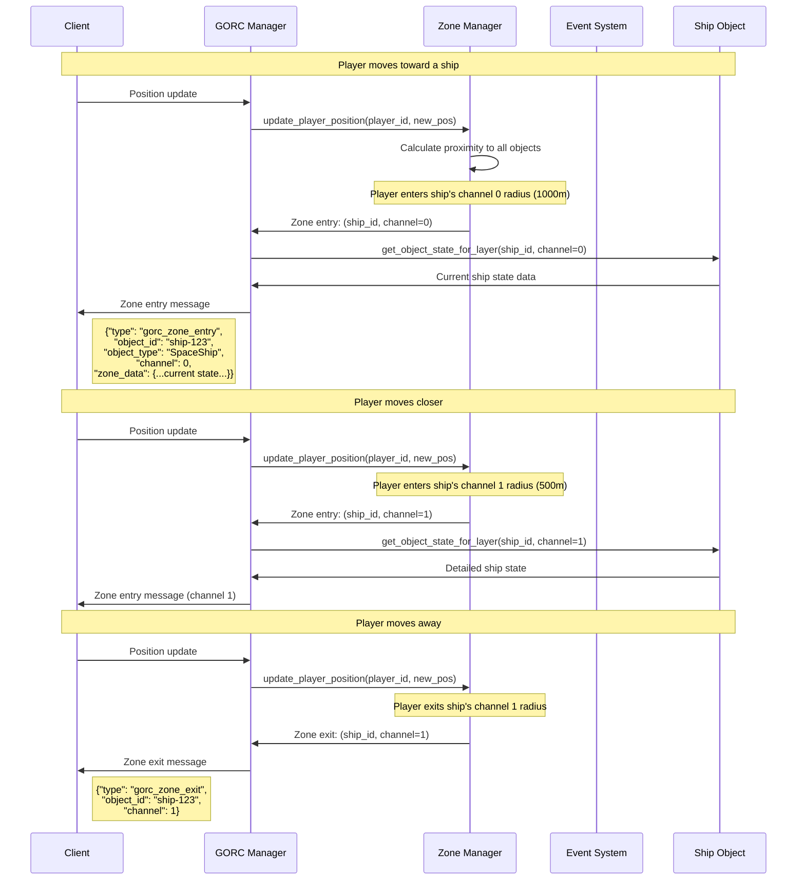
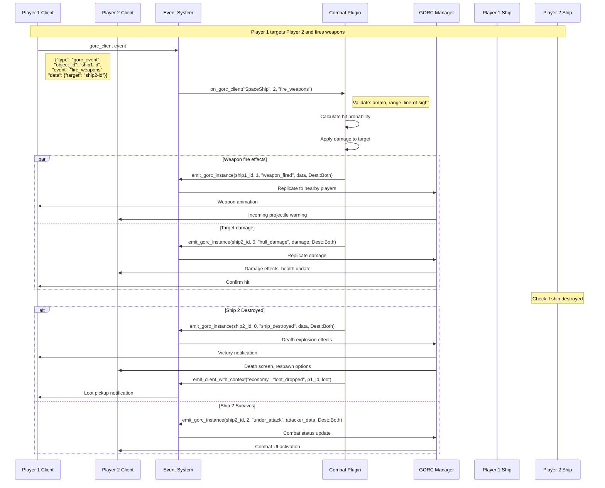
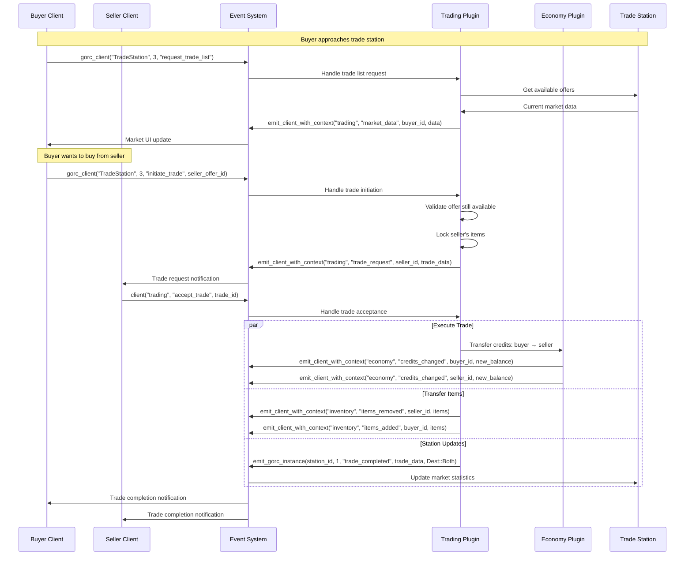
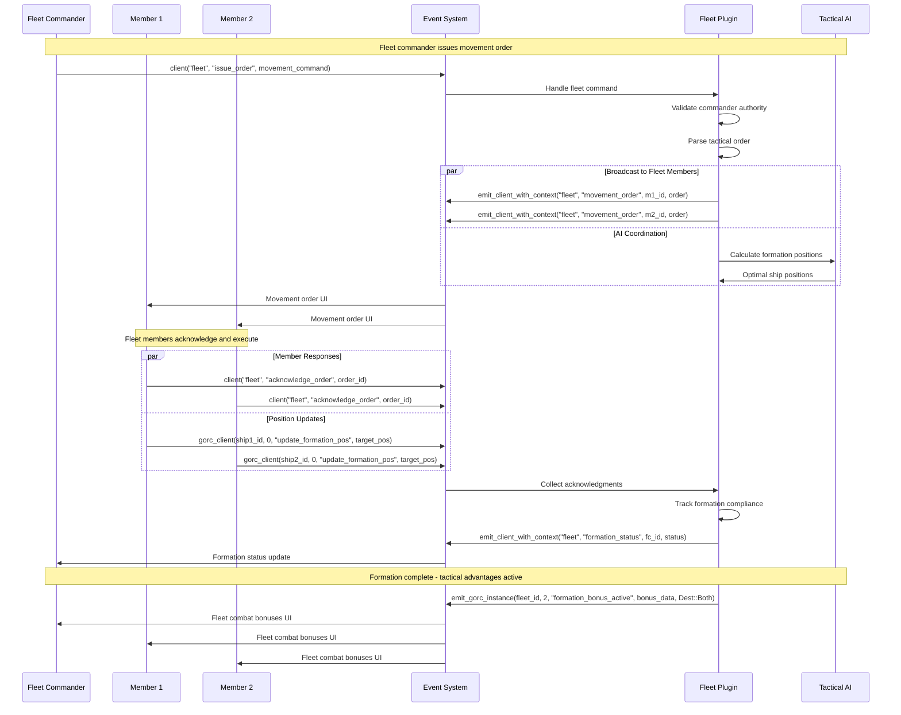
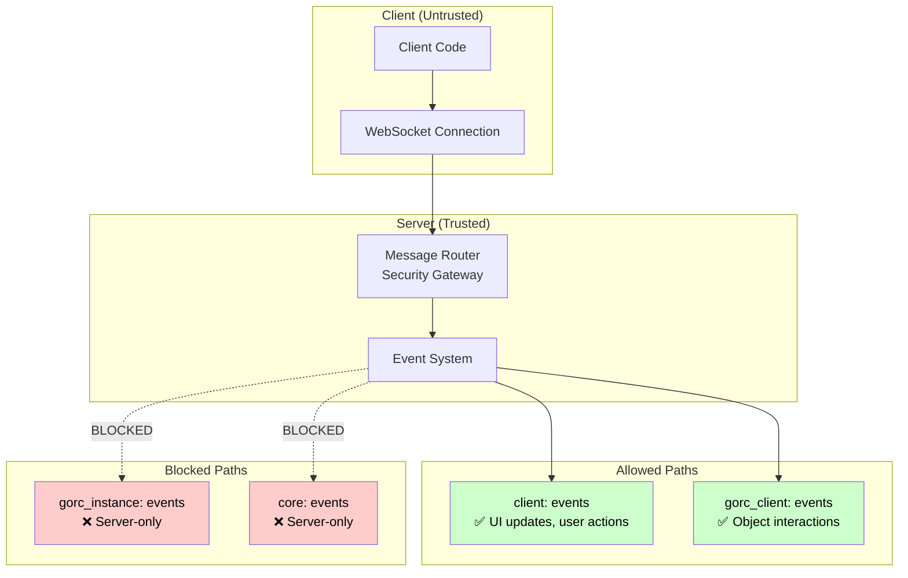

# Horizon Event System Guide

This comprehensive guide demonstrates how Horizon's event system components work together in the context of a space MMO. The system provides secure, scalable event routing between clients, server components, and plugins.

## Table of Contents

1. [System Architecture Overview](#system-architecture-overview)
2. [Event Categories](#event-categories)
3. [Client-to-Server Communication](#client-to-server-communication)
4. [Server Internal Events](#server-internal-events)
5. [GORC Replication System](#gorc-replication-system)
6. [Complete Use Case Examples](#complete-use-case-examples)
7. [Security Model](#security-model)
8. [Performance Optimizations](#performance-optimizations)

## System Architecture Overview



## Event Categories

The Horizon event system uses three main event categories, each with distinct security and routing characteristics:

### 1. Client Events (`client:namespace:event`)
**Purpose**: Regular client-server communication for UI updates, user actions, etc.

```rust
// Registration (Plugin side)
events.on_client("chat", "send_message", |event: ChatMessageEvent| {
    println!("Player sent chat message: {}", event.message);
    Ok(())
}).await?;

// Emission (Client → Server via WebSocket)
{
    "namespace": "chat",
    "event": "send_message", 
    "data": { "message": "Hello, universe!" }
}
```

### 2. GORC Client Events (`gorc_client:ObjectType:channel:event`)
**Purpose**: Client interactions with server objects (mining, combat, trading, etc.)

```rust
// Registration (Plugin side)
events.on_gorc_client("Asteroid", 3, "mine", 
    |event: GorcEvent, client_player: PlayerId, instance: &mut ObjectInstance| {
        // Validate mining permissions and proximity
        // Update asteroid resources
        // Award materials to player
        Ok(())
    }
).await?;

// Emission (Client → Server via WebSocket)
{
    "type": "gorc_event",
    "object_id": "GorcObjectId(asteroid-uuid)",
    "channel": 3,
    "event": "mine",
    "data": { "mining_tool": "plasma_drill", "duration": 5000 }
}
```

### 3. GORC Instance Events (`gorc_instance:ObjectType:channel:event`)
**Purpose**: Server-internal object state changes that replicate to nearby clients

```rust
// Registration (Plugin side)
events.on_gorc_instance("SpaceShip", 0, "position_update", 
    |event: GorcEvent, instance: &mut ObjectInstance| {
        // Update internal ship state
        // Physics calculations
        Ok(())
    }
).await?;

// Emission (Server internal only)
events.emit_gorc_instance(ship_id, 0, "position_update", &position_data, Dest::Both).await?;
```

## Client-to-Server Communication

### Example: Player Mining an Asteroid



### Code Implementation

**Client Side (JavaScript/WebAssembly)**:
```javascript
function mineAsteroid(asteroidId, miningTool) {
    const miningRequest = {
        type: "gorc_event",
        object_id: asteroidId,
        channel: 3, // Interaction channel
        event: "mine",
        data: {
            tool: miningTool,
            duration_ms: 5000
        }
    };
    
    websocket.send(JSON.stringify(miningRequest));
}
```

**Server Plugin**:
```rust
impl Plugin for MiningPlugin {
    async fn register_handlers(&mut self, events: Arc<EventSystem>, context: Arc<dyn ServerContext>) -> Result<(), PluginError> {
        // Handle client mining requests
        events.on_gorc_client("Asteroid", 3, "mine", {
            let context = context.clone();
            move |event: GorcEvent, client_player: PlayerId, asteroid: &mut ObjectInstance| {
                // Parse mining data
                let mining_data: MiningRequest = serde_json::from_slice(&event.data)?;
                
                // Validate player has the tool
                if !player_has_tool(client_player, &mining_data.tool)? {
                    return Err(EventError::HandlerExecution("Missing required tool".to_string()));
                }
                
                // Check proximity (asteroid position vs player position)
                let player_pos = get_player_position(client_player)?;
                let asteroid_pos = asteroid.object.position();
                if player_pos.distance(asteroid_pos) > MINING_RANGE {
                    return Err(EventError::HandlerExecution("Too far from asteroid".to_string()));
                }
                
                // Extract resources
                let extracted = extract_resources(asteroid, &mining_data.tool, mining_data.duration_ms);
                
                // Update asteroid state
                asteroid.object.set_health(asteroid.object.health() - extracted.damage);
                
                // Award resources to player
                add_to_player_inventory(client_player, extracted.materials)?;
                
                // Emit resource depletion event to nearby players
                context.events().emit_gorc_instance(
                    event.object_id.parse()?, 
                    1, // Detail channel
                    "resource_depleted", 
                    &ResourceDepletedEvent {
                        remaining_health: asteroid.object.health(),
                        extracted_materials: extracted.materials.clone(),
                        extractor_player: client_player,
                    },
                    horizon_event_system::Dest::Both
                )?;
                
                Ok(())
            }
        }).await?;
        
        Ok(())
    }
}
```

## Server Internal Events

### Example: Ship Movement and Combat



### Multi-Channel Replication Example

Different channels serve different purposes and have different ranges:

```rust
// Channel 0: Critical (long range) - Position, health
events.emit_gorc_instance(ship_id, 0, "position_update", &pos, Dest::Both).await?;

// Channel 1: Detailed (medium range) - Combat status, shields  
events.emit_gorc_instance(ship_id, 1, "shield_hit", &damage, Dest::Both).await?;

// Channel 2: Social (medium range) - Chat, emotes
events.emit_gorc_instance(ship_id, 2, "player_chat", &msg, Dest::Both).await?;

// Channel 3: Metadata (short range) - Detailed scans, cargo
events.emit_gorc_instance(ship_id, 3, "cargo_scan_result", &cargo, Dest::Both).await?;
```

## GORC Replication System

The GORC (Game Object Replication & Communication) system handles efficient state synchronization between server objects and clients based on proximity.

### Zone Entry/Exit Flow



### Replication Layer Configuration

```rust
// Example: SpaceShip replication layers
impl GorcObject for SpaceShip {
    fn get_layers(&self) -> Vec<ReplicationLayer> {
        vec![
            ReplicationLayer {
                channel: 0,
                radius: 1000.0,    // 1km - Basic presence
                update_frequency: 10.0, // 10 Hz
                compression_level: CompressionLevel::High,
            },
            ReplicationLayer {
                channel: 1,
                radius: 500.0,     // 500m - Combat details  
                update_frequency: 30.0, // 30 Hz
                compression_level: CompressionLevel::Medium,
            },
            ReplicationLayer {
                channel: 2, 
                radius: 300.0,     // 300m - Chat/social
                update_frequency: 5.0,  // 5 Hz
                compression_level: CompressionLevel::Low,
            },
            ReplicationLayer {
                channel: 3,
                radius: 100.0,     // 100m - Detailed scans
                update_frequency: 60.0, // 60 Hz  
                compression_level: CompressionLevel::None,
            },
        ]
    }
}
```

## Complete Use Case Examples

### 1. Player vs Player Combat Sequence



### 2. Trading Between Players



### 3. Fleet Coordination



## Security Model

The event system enforces strict security boundaries between client and server code:

### Client Security Restrictions



### Security Validation Flow

```rust
// Example: Mining validation in gorc_client handler
events.on_gorc_client("Asteroid", 3, "mine", 
    |event: GorcEvent, client_player: PlayerId, asteroid: &mut ObjectInstance| {
        
        // 1. Proximity Check
        let player_pos = get_player_position(client_player)?;
        let asteroid_pos = asteroid.object.position();
        if player_pos.distance(asteroid_pos) > MAX_MINING_RANGE {
            return Err(EventError::HandlerExecution("Player too far from asteroid".into()));
        }
        
        // 2. Equipment Check  
        let player_ship = get_player_ship(client_player)?;
        if !player_ship.has_mining_equipment() {
            return Err(EventError::HandlerExecution("No mining equipment equipped".into()));
        }
        
        // 3. Cooldown Check
        if !check_mining_cooldown(client_player) {
            return Err(EventError::HandlerExecution("Mining still on cooldown".into()));
        }
        
        // 4. Asteroid State Check
        if asteroid.object.health() <= 0.0 {
            return Err(EventError::HandlerExecution("Asteroid is depleted".into()));
        }
        
        // All checks passed - execute mining
        execute_mining_operation(client_player, asteroid)
    }
).await?;
```

### Anti-Cheat Features

1. **Server Authority**: All game state changes happen server-side
2. **Proximity Validation**: Client actions validated against server position data  
3. **Rate Limiting**: Built-in cooldowns prevent spam/exploitation
4. **State Verification**: Server validates all client requests against current game state
5. **Audit Trail**: All client events logged with player ID and timestamp

## Performance Optimizations

### Path-Based Event Routing

The system uses a hierarchical PathRouter for efficient event lookups:

```rust
// Traditional flat lookup: O(n) scan for similar events
// handlers.get("gorc_instance:SpaceShip:0:move") -> None
// scan all handlers for debugging: expensive!

// Path-based lookup: O(log n) tree traversal  
// gorc_instance -> SpaceShip -> 0 -> move
// Find similar paths by tree traversal: efficient!
```

### GORC Replication Optimizations

1. **Proximity-Based Updates**: Only send events to players within range
2. **Channel Layering**: Different update frequencies per detail level
3. **Compression**: Higher compression for distant/less critical updates  
4. **Batching**: Multiple events combined into single WebSocket messages
5. **Delta Compression**: Only send changed state, not full snapshots

### Event Handler Performance

```rust
// Lock-free concurrent access using DashMap
pub struct EventSystem {
    handlers: DashMap<CompactString, SmallVec<[Arc<dyn EventHandler>; 4]>>,
    // ...
}

// SmallVec optimization: no heap allocation for ≤4 handlers per event
// Arc<dyn EventHandler>: shared ownership, efficient cloning
// CompactString: reduced memory usage for short event keys
```

### Serialization Optimizations

```rust
// High-performance serialization pool
pub struct SerializationBufferPool {
    // Pre-allocated buffers, reused across events
    // Reduces allocation pressure under high load
}

// Event data shared via Arc<Vec<u8>>
// Single serialization, multiple handler deliveries
let data = self.serialization_pool.serialize_event(event)?;
for handler in event_handlers.iter() {
    let data_arc = data.clone(); // Clone Arc, not data
    // ...
}
```