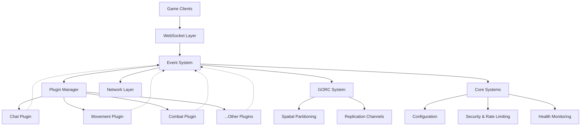
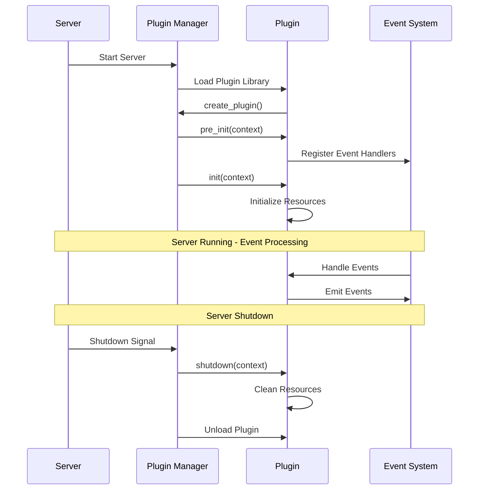
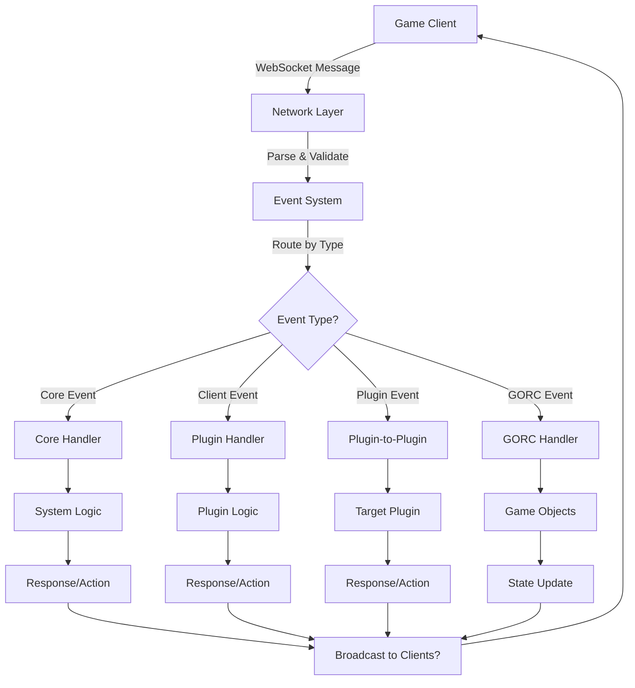
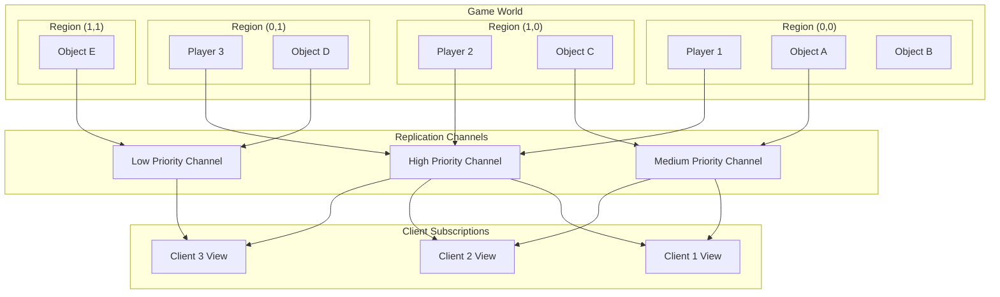

<div align="center">
  
</div>

<br>

[](LICENSE)
[](https://www.rust-lang.org/)

A high-performance, modular game server architecture built in Rust, designed for large-scale multiplayer games with real-time networking requirements. The server provides a plugin-first architecture that separates infrastructure concerns from game logic, enabling rapid development and deployment of multiplayer game features.

## Before you continue

**Do you like this project?** You may like the pulsar game engine from many of the same developers who work on Horizon. [Check it out](https://github.com/Far-Beyond-Pulsar/Pulsar-Native)

## Table of Contents

- [Overview](#overview)
- [Architecture](#architecture)
- [Quick Start](#quick-start)
- [Configuration](#configuration)
- [Plugin Development](#plugin-development)
- [Event System](#event-system)
- [GORC System](#gorc-system)
- [Security](#security)
- [Deployment](#deployment)
- [Performance](#performance)
- [Contributing](#contributing)

## Overview

Horizon addresses the common challenges in multiplayer game server development by providing a robust foundation that handles networking, player management, and real-time data synchronization while keeping game-specific logic in isolated, hot-reloadable plugins. This architecture allows teams to focus on game mechanics rather than infrastructure concerns.

The server is built around three core principles: modularity through a comprehensive plugin system, performance through efficient async networking and memory management, and reliability through comprehensive error handling and monitoring capabilities. The result is a server that can handle thousands of concurrent players while maintaining low latency and high availability.

## Architecture

### System Overview



### Core Components

The server architecture consists of several interconnected systems that work together to provide a complete multiplayer gaming infrastructure. The EventSystem serves as the central nervous system, routing messages between different components using a type-safe event handling mechanism. This design ensures that different parts of the system can communicate efficiently while maintaining strict boundaries between concerns.

The Plugin System enables dynamic loading and hot-reloading of game logic without server restarts. Plugins are isolated from each other and from core server functionality, providing stability and security while allowing for rapid iteration during development. Each plugin operates in its own namespace and can register handlers for specific event types.

The GORC (Game Object Replication Channels) system handles real-time synchronization of game state between server and clients. It provides efficient spatial partitioning, level-of-detail management, and selective replication based on player proximity and game mechanics. This system is crucial for maintaining consistent game state across all connected players.

### Network Layer

The networking layer is built on top of async Rust with tokio, providing high-performance WebSocket connections that can handle thousands of concurrent players. The server implements connection pooling, automatic cleanup of stale connections, and configurable rate limiting to protect against abuse. Network messages are processed asynchronously to ensure that slow clients don't impact overall server performance.

Connection management includes automatic heartbeat monitoring, graceful disconnection handling, and reconnection support for mobile clients with unstable network conditions. The server tracks connection statistics and provides detailed metrics for monitoring and debugging network issues.

## Quick Start

### Prerequisites

Ensure you have Rust 1.70 or later installed on your system. The server has been tested on Linux, macOS, and Windows platforms. Additional dependencies include openssl-dev (Linux) or equivalent security libraries for TLS support.

### Installation

Clone the repository and build the server:

```bash
git clone https://github.com/Far-Beyond-Dev/horizon.git
cd horizon
cargo build --release
```

The build process will compile all core components and example plugins. The resulting binary will be located in `target/release/horizon`.

### First Run

Start the server with default configuration:

```bash
./target/release/horizon
```

The server will bind to `localhost:8080` by default and look for plugins in the `plugins/` directory.

### Configuration

Create a `config.toml` file to customize server behavior:

```toml
[server]
bind_address = "127.0.0.1:8080"
max_connections = 1000
connection_timeout = 60
use_reuse_port = false
tick_interval_ms = 50
plugin_directory = "plugins"

[server.region_bounds]
min_x = -1000.0
max_x = 1000.0
min_y = -1000.0
max_y = 1000.0
min_z = -100.0
max_z = 100.0

[server.security]
enable_rate_limiting = true
max_requests_per_minute = 60
max_message_size = 65536
enable_ddos_protection = true
max_connections_per_ip = 10
```

Configuration options cover network settings, security parameters, plugin management, and game world boundaries. The server validates all configuration values at startup and provides detailed error messages for invalid settings.

## Plugin Development

### Plugin Lifecycle



### Plugin Structure

Plugins are dynamic libraries that implement the Plugin trait from the horizon_event_system crate. Each plugin operates independently and communicates with the server and other plugins through the event system. This design ensures that plugin crashes or errors don't affect other components.

A basic plugin structure looks like this:

```rust
use async_trait::async_trait;
use chrono::prelude::*;
use horizon_event_system::{
    create_simple_plugin, current_timestamp, register_handlers, EventSystem, LogLevel,
    PlayerId, PluginError, Position, ServerContext, SimplePlugin,
};
use serde::{Deserialize, Serialize};
use std::sync::Arc;

pub struct GreeterPlugin {
    name: String,
    welcome_count: u32,
}

impl GreeterPlugin {
    pub fn new() -> Self {
        println!("🎉 GreeterPlugin: Creating new instance");
        Self {
            name: "greeter".to_string(),
            welcome_count: 0,
        }
    }
}

impl Default for GreeterPlugin {
    fn default() -> Self {
        Self::new()
    }
}

#[async_trait]
impl SimplePlugin for GreeterPlugin {
    fn name(&self) -> &str {
        &self.name
    }

    fn version(&self) -> &str {
        "1.0.0"
    }

    async fn register_handlers(&mut self, events: Arc<EventSystem>, _context: Arc<dyn ServerContext>) -> Result<(), PluginError> {
        println!("👋 GreeterPlugin: Registering event handlers...");

        Ok(())
    }

    async fn on_init(&mut self, context: Arc<dyn ServerContext>) -> Result<(), PluginError> {
        context.log(
            LogLevel::Info,
            "👋 GreeterPlugin: Starting up! Ready to welcome players!",
        );
    }
}

// Create the plugin using our macro - zero unsafe code!
create_simple_plugin!(GreeterPlugin);
```

### Event Handling

The event system provides four types of event handlers corresponding to different aspects of game server operation. Core events handle server lifecycle and system-level operations. Client events process messages from connected players. Plugin events enable inter-plugin communication. GORC events manage game object replication and state synchronization.

Event handlers are type-safe and use Rust's ownership system to prevent common concurrency issues. The event system automatically handles serialization, routing, and error recovery. Handlers can be synchronous for simple operations or asynchronous for complex processing that involves I/O or network operations.

### Plugin Examples

The repository includes several example plugins that demonstrate common patterns:

- **Chat Plugin**: Handles player chat messages, moderation, and channels
- **Movement Plugin**: Processes player movement and validates positions
- **Combat Plugin**: Manages player vs player and player vs environment combat
- **Economy Plugin**: Handles virtual currency, trading, and market operations

Each example plugin includes extensive documentation and demonstrates best practices for error handling, state management, and inter-plugin communication.

## Event System

The event system is the backbone of the server architecture, providing type-safe communication between all components. Events are strongly typed using Rust's type system, preventing runtime errors and ensuring that data contracts between components are maintained correctly.

### Event Flow



### Event Categories

Core events handle server-wide operations like player connections, server ticks, and system notifications. These events are generated by the server infrastructure and are typically used for monitoring, logging, and maintaining global state.

Client events represent messages from connected players, such as movement commands, chat messages, and game actions. These events are validated, rate-limited, and routed to appropriate plugin handlers based on the event namespace and type.

Plugin events enable communication between different plugins without tight coupling. Plugins can emit events that other plugins can subscribe to, creating a flexible architecture for complex game mechanics that span multiple systems.

GORC events handle game object lifecycle and replication. These events are generated when game objects are created, updated, or destroyed, and are used to maintain consistent game state across all connected clients.

### Handler Registration

Event handlers are registered during plugin initialization and use a namespace-based routing system. This design allows multiple plugins to handle the same event type independently, enabling flexible architectures where different aspects of game logic can be handled by specialized plugins.

The event system provides both synchronous and asynchronous handler registration, depending on the complexity of the handler logic. Synchronous handlers are preferred for simple operations, while asynchronous handlers should be used for operations that involve I/O, network requests, or complex computations.

## GORC System

The Game Object Replication Channels (GORC) system manages real-time synchronization of game objects between server and clients. This system is essential for maintaining consistent game state in large scale multiplayer environments where many players interact with shared game objects.

### Spatial Partitioning



GORC uses spatial partitioning to efficiently manage large game worlds with thousands of objects and players. The world is divided into regions each of which are spatially indexed, and objects are tracked based on their position. This allows the server to send updates only to players who are in proximity to changed objects, significantly reducing network bandwidth requirements.

The spatial partitioning system supports dynamic resizing and load balancing, ensuring that performance remains consistent even as players cluster in specific areas of the game world. The system also handles edge cases like objects that span multiple regions or move rapidly between regions.

### Replication Channels

Object events can be replicated on multiple channels with different priorities High-priority channels are used for critical game objects like players and important NPCs, while low-priority channels handle environmental objects and decorative elements.

The channels have a physical size in 3D space meaning the system also allows for sophisticated level-of-detail management where distant objects receive fewer updates than nearby objects (due to being subscribed only to the larger, more broad channels that apply to them). This approach maintains visual consistency up close while optimizing network usage and server performance.

### Subscription Management

Players automatically subscribe to relevant replication channels based on their position, view distance, and game-specific criteria. The subscription system handles player movement, ensuring that subscriptions are updated as players move through the game world.

Subscription management includes support for custom subscription rules defined by plugins, allowing for game-specific optimizations like subscribing to guild member positions regardless of distance or prioritizing certain object types based on player preferences.

## Security

The server includes comprehensive security features designed to protect against common attacks and abuse patterns in online gaming. Security measures are configurable and can be adjusted based on the specific requirements of different game types and deployment environments.

### Input Validation

All incoming messages are validated against configurable limits for size, structure, and content. The validation system prevents malformed JSON, oversized messages, and potentially malicious content from reaching plugin handlers. Validation rules can be customized for different message types and player authentication levels.

The input validation system includes protection against JSON bombs, regex denial-of-service attacks, and injection attempts. Failed validation attempts are logged and can trigger automatic rate limiting or connection termination for repeat offenders.

### Rate Limiting

Rate limiting is implemented using a token bucket algorithm that allows for burst traffic while preventing sustained abuse. Limits can be configured per IP address, per authenticated user, or globally across all connections. The system supports different rate limits for different types of operations.

Rate limiting includes configurable penalties for violations, ranging from temporary delays to connection termination. The system maintains statistics on rate limiting effectiveness and provides detailed metrics for monitoring and tuning.

### DDoS Protection

The server includes several layers of DDoS protection, including connection limits per IP address, bandwidth monitoring, and automatic blacklisting of abusive sources. These protections are designed to maintain service availability during attack conditions while minimizing impact on legitimate players.

DDoS protection includes support for external threat intelligence feeds and can integrate with cloud-based DDoS mitigation services. The system provides real-time dashboards for monitoring attack patterns and adjusting defensive measures.

## Deployment

### Production Configuration

Production deployments require careful configuration of security, performance, and monitoring settings. The server includes production-ready configuration templates that enable appropriate security measures, performance optimizations, and comprehensive logging.

Key production considerations include SSL/TLS termination, load balancer configuration, database connections, and external service integrations. The server supports deployment behind reverse proxies and includes health check endpoints for load balancer integration.

### Container Deployment

The server is fully containerized and includes Docker and Kubernetes deployment configurations. Container deployments support automatic scaling, rolling updates, and health monitoring. The container images are optimized for size and security, using minimal base images and non-root execution.

Container deployment includes support for secrets management, environment-specific configuration injection, and integration with container orchestration platforms. The system provides detailed metrics for container runtime monitoring and resource usage optimization.

### Monitoring and Observability

Production deployments require comprehensive monitoring to ensure service availability and performance. The server exports metrics in Prometheus format and includes detailed logging with structured JSON output for analysis platforms.

Monitoring includes application-level metrics like player counts, event processing rates, and plugin performance, as well as system-level metrics like memory usage, CPU utilization, and network throughput. The system provides alerting capabilities for critical conditions and performance degradation.

## Performance

The server is designed for high-performance operation with thousands of concurrent connections. Performance optimizations include async I/O throughout the stack, memory pool management for frequently allocated objects, and efficient data structures for event routing and game object management.

### Benchmarks

Under optimal conditions with modern hardware, the server can handle over 10,000 concurrent connections with sub-millisecond event routing latency. Performance scales linearly with CPU cores due to the async architecture and careful lock management.

Benchmark results vary based on plugin complexity, message rates, and game object density. The repository includes comprehensive benchmarking tools and performance testing scenarios that can be used to validate performance in specific deployment environments.

### Optimization

Performance optimization focuses on minimizing memory allocations, reducing lock contention, and optimizing hot paths in event processing. The server includes extensive profiling hooks and can generate detailed performance reports for optimization analysis.

Common optimization techniques include connection pooling, message batching, and predictive caching of frequently accessed game objects. The plugin system allows for game-specific optimizations without modifying core server code.

## Contributing

We welcome contributions from the community, including bug fixes, performance improvements, new features, and documentation updates. The project follows standard Rust community practices for code style, testing, and documentation.

Before contributing, please review the contribution guidelines and ensure that your changes include appropriate tests and documentation. Large features should be discussed in GitHub issues before implementation to ensure alignment with project goals and architecture.

The development process includes continuous integration with automated testing, code coverage reporting, and performance regression detection. All contributions undergo code review by project maintainers to ensure quality and consistency with the existing codebase.

## License


This project is licensed under the Apache License 2.0. See the LICENSE file for details.
