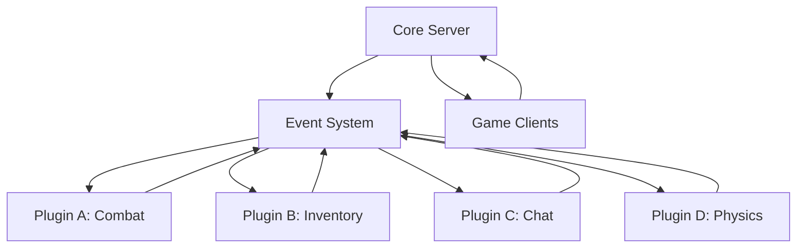
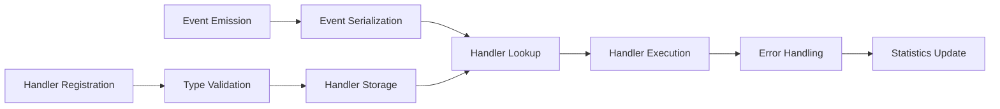

# Horizon Event System

A high-performance, type-safe event system designed for game servers with plugin architecture and advanced state management capabilities. The Horizon Event System provides the foundation for building scalable multiplayer games with clean separation between core server functionality and game-specific plugins.

## Philosophy and Design

The Horizon Event System was built around the principle that game servers should be composable, not monolithic. Rather than cramming all game logic into a single codebase, the system enables developers to build games as collections of focused, independent plugins that communicate through a robust event system.

Think of it as the nervous system of your game server—events flow through well-defined channels, reaching exactly the components that need them, when they need them. This approach makes games easier to develop, test, and maintain while providing the performance characteristics needed for real-time multiplayer experiences.



## Quick Start

Getting started with the Horizon Event System is straightforward. Here's a minimal example that shows the core concepts:

```rust
use horizon_event_system::*;

#[tokio::main]
async fn main() -> Result<(), Box<dyn std::error::Error>> {
    // Create the event system
    let events = create_horizon_event_system();
    
    // Register a handler for player connections
    events.on_core("player_connected", |event: PlayerConnectedEvent| {
        println!("Player {} joined from {}", event.player_id, event.remote_addr);
        Ok(())
    }).await?;
    
    // Emit an event
    events.emit_core("player_connected", &PlayerConnectedEvent {
        player_id: PlayerId::new(),
        connection_id: "conn_123".to_string(),
        remote_addr: "192.168.1.100:45678".to_string(),
        timestamp: current_timestamp(),
    }).await?;
    
    Ok(())
}
```

That's it! You've just created an event system, registered a handler, and emitted an event. The system handles all the complexity of routing, serialization, and execution while providing compile-time type safety.

## Event Categories

The Horizon Event System organizes events into four distinct categories, each designed for specific communication patterns within your game server.

### Core Events

Core events represent fundamental server infrastructure happenings. These are the events that the server itself emits to notify plugins about system-level changes.

```rust
// Listen for server infrastructure events
events.on_core("server_started", |event: ServerStartedEvent| {
    println!("Server is now online and accepting connections");
    Ok(())
}).await?;

events.on_core("player_disconnected", |event: PlayerDisconnectedEvent| {
    println!("Player {} left (reason: {:?})", event.player_id, event.reason);
    cleanup_player_data(event.player_id).await?;
    Ok(())
}).await?;

events.on_core("region_started", |event: RegionStartedEvent| {
    initialize_region_resources(event.region_id, &event.bounds).await?;
    Ok(())
}).await?;
```

Common core events include player connections and disconnections, plugin lifecycle events, region management, and server status changes. These events form the backbone of server operations and are typically handled by multiple plugins that need to react to infrastructure changes.

### Client Events

Client events originate from game clients and represent player actions or messages. The system organizes these by namespace to provide logical grouping and prevent conflicts between different game systems.

```rust
// Handle movement-related client messages
events.on_client("movement", "position_update", |event: RawClientMessageEvent| {
    let position = parse_position_data(&event.data)?;
    update_player_position(event.player_id, position).await?;
    Ok(())
}).await?;

// Handle chat messages
events.on_client("chat", "message", |event: RawClientMessageEvent| {
    let chat_data = parse_chat_message(&event.data)?;
    if !is_message_allowed(&chat_data) {
        return Err(EventError::HandlerExecution("Message blocked".to_string()));
    }
    broadcast_chat_message(event.player_id, &chat_data).await?;
    Ok(())
}).await?;

// Handle inventory actions
events.on_client("inventory", "use_item", |event: RawClientMessageEvent| {
    let item_data = parse_item_usage(&event.data)?;
    apply_item_effects(event.player_id, &item_data).await?;
    Ok(())
}).await?;
```

The namespace system allows different plugins to handle their specific client messages without interfering with each other. For example, a movement plugin handles "movement" namespace events while a chat plugin handles "chat" namespace events.

### Plugin Events

Plugin events enable communication between different plugins without creating tight dependencies. This loose coupling makes it possible to develop, test, and deploy plugins independently while still allowing them to work together seamlessly.

```rust
// Combat plugin listens for inventory changes
events.on_plugin("inventory", "item_equipped", |event: ItemEquippedEvent| {
    update_combat_stats(event.player_id, &event.item_id).await?;
    Ok(())
}).await?;

// Quest plugin listens for combat events
events.on_plugin("combat", "enemy_defeated", |event: EnemyDefeatedEvent| {
    progress_kill_quests(event.player_id, &event.enemy_type).await?;
    Ok(())
}).await?;

// Achievement plugin listens to many different events
events.on_plugin("chat", "message_sent", |event: MessageSentEvent| {
    check_social_achievements(event.player_id).await?;
    Ok(())
}).await?;
```

Plugin events create a publish-subscribe pattern where plugins can announce what they're doing without needing to know which other plugins might be interested. This pattern is particularly powerful for cross-cutting concerns like achievements, analytics, and logging.

## Building Plugins

The Horizon Event System makes plugin development straightforward through the `SimplePlugin` trait and supporting macros. Here's how to build a complete plugin:

```rust
use horizon_event_system::*;

struct WeatherPlugin {
    current_weather: WeatherState,
    update_interval: Duration,
}

impl WeatherPlugin {
    fn new() -> Self {
        Self {
            current_weather: WeatherState::Clear,
            update_interval: Duration::from_secs(300), // 5 minutes
        }
    }
}

#[async_trait]
impl SimplePlugin for WeatherPlugin {
    fn name(&self) -> &str { "weather_system" }
    fn version(&self) -> &str { "1.0.0" }
    
    async fn register_handlers(&mut self, events: Arc<EventSystem>, context: Arc<dyn ServerContext>) -> Result<(), PluginError> {
        // Listen for time progression
        events.on_core("game_tick", |event: GameTickEvent| {
            if should_update_weather(event.timestamp) {
                update_weather_state().await?;
            }
            Ok(())
        }).await?;
        
        // Handle weather change requests from other plugins
        events.on_plugin("admin", "set_weather", |event: SetWeatherEvent| {
            change_weather_to(event.new_weather).await?;
            Ok(())
        }).await?;
        
        Ok(())
    }
    
    async fn on_init(&mut self, context: Arc<dyn ServerContext>) -> Result<(), PluginError> {
        context.log(LogLevel::Info, "Weather system initialized");
        self.schedule_weather_updates().await?;
        Ok(())
    }
}

// This macro generates all the FFI boilerplate
create_simple_plugin!(WeatherPlugin);
```

The `create_simple_plugin!` macro handles all the complex foreign function interface (FFI) code needed for dynamic loading, including panic isolation to ensure that plugin crashes don't bring down the entire server.

### Advanced Plugin Patterns

For more complex plugins, you can use the bulk registration macro to set up many handlers at once:

```rust
async fn register_handlers(&mut self, events: Arc<EventSystem>, context: Arc<dyn ServerContext>) -> Result<(), PluginError> {
    register_handlers!(events;
        core {
            "player_connected" => |event: PlayerConnectedEvent| {
                initialize_player_combat_data(event.player_id).await?;
                Ok(())
            },
            "player_disconnected" => |event: PlayerDisconnectedEvent| {
                save_combat_statistics(event.player_id).await?;
                Ok(())
            }
        }
        client {
            "combat", "attack" => |event: RawClientMessageEvent| {
                handle_attack_command(event.player_id, &event.data).await?;
                Ok(())
            },
            "combat", "block" => |event: RawClientMessageEvent| {
                handle_block_command(event.player_id, &event.data).await?;
                Ok(())
            }
        }
        plugin {
            "inventory", "item_equipped" => |event: ItemEquippedEvent| {
                update_combat_bonuses(event.player_id, &event.item).await?;
                Ok(())
            }
        }
    );
    Ok(())
}
```

This declarative syntax makes it easy to see all the events a plugin handles and keeps the registration code organized and maintainable.

## Type Safety and Error Handling

One of the key strengths of the Horizon Event System is its compile-time type safety. Events are strongly typed, which means you can't accidentally send the wrong type of data or forget to handle a field.

```rust
// Define custom event types - Event trait is automatically implemented
#[derive(Serialize, Deserialize, Clone, Debug)]
struct SpellCastEvent {
    caster_id: PlayerId,
    target_id: Option<PlayerId>,
    spell_id: String,
    mana_cost: u32,
    cast_time: Duration,
    position: Vec3,
}

// Event trait is automatically implemented for types with:
// Serialize + DeserializeOwned + Send + Sync + Any + Debug + 'static

// Register a handler with full type checking
events.on_plugin("magic", "spell_cast", |event: SpellCastEvent| {
    // The compiler ensures this handler receives SpellCastEvent
    // and that all fields are properly typed
    validate_spell_prerequisites(event.caster_id, &event.spell_id)?;
    consume_mana(event.caster_id, event.mana_cost)?;
    apply_spell_effects(event.target_id, &event.spell_id, event.position)?;
    Ok(())
}).await?;
```

Error handling is built into the system at every level. Handler functions return `Result` types, and the event system automatically logs errors without stopping event processing:

```rust
events.on_client("inventory", "drop_item", |event: RawClientMessageEvent| {
    // Parse the message data
    let drop_request = match parse_drop_request(&event.data) {
        Ok(request) => request,
        Err(e) => return Err(EventError::HandlerExecution(
            format!("Invalid drop request: {}", e)
        )),
    };
    
    // Validate the drop is allowed
    if !can_drop_item(event.player_id, &drop_request.item_id) {
        return Err(EventError::HandlerExecution(
            "Player cannot drop this item".to_string()
        ));
    }
    
    // Execute the drop
    drop_item_in_world(event.player_id, drop_request)?;
    Ok(())
}).await?;
```

When a handler returns an error, the event system logs the error with full context but continues processing other handlers and events. This isolation prevents one buggy handler from disrupting the entire system.

## Performance and Scalability

The Horizon Event System is designed for high-performance multiplayer games that need to process thousands of events per second while maintaining low latency. Several design decisions contribute to this performance:

Handler lookup is O(1) using hash maps, so adding more event types doesn't slow down the system. Event serialization happens once per emission, not once per handler, reducing CPU overhead when multiple handlers listen to the same event.

```rust
// Even with many handlers for the same event, serialization only happens once
events.on_core("player_moved", |event: PlayerMovedEvent| { /* Handler 1 */ Ok(()) }).await?;
events.on_core("player_moved", |event: PlayerMovedEvent| { /* Handler 2 */ Ok(()) }).await?;
events.on_core("player_moved", |event: PlayerMovedEvent| { /* Handler 3 */ Ok(()) }).await?;

// When this event is emitted, it's serialized once and sent to all three handlers
events.emit_core("player_moved", &PlayerMovedEvent { 
    player_id, 
    new_position, 
    timestamp 
}).await?;
```

The system provides detailed statistics for monitoring performance and identifying bottlenecks:

```rust
let stats = events.get_stats().await;
println!("Event system has {} registered handlers", stats.total_handlers);
println!("Processed {} events since startup", stats.events_emitted);

// Use these stats for monitoring and alerting
if stats.total_handlers > 10000 {
    log_warning("Very high number of event handlers - consider optimization");
}
```

## Integration with Server Infrastructure

The Horizon Event System integrates cleanly with broader server infrastructure through the `ServerContext` trait. This provides plugins with access to core server services without tight coupling:

```rust
#[async_trait]
impl SimplePlugin for NetworkingPlugin {
    async fn on_init(&mut self, context: Arc<dyn ServerContext>) -> Result<(), PluginError> {
        // Access logging
        context.log(LogLevel::Info, "Networking plugin starting up");
        
        // Send data to specific players
        let welcome_message = b"Welcome to the server!";
        context.send_to_player(new_player_id, welcome_message).await?;
        
        // Broadcast announcements
        let announcement = b"Server maintenance in 10 minutes";
        context.broadcast(announcement).await?;
        
        // Get regional context
        let region_id = context.region_id();
        context.log(LogLevel::Debug, &format!("Plugin active in region {}", region_id));
        
        Ok(())
    }
}
```

This abstraction means plugins can access server services without depending on specific implementations, making them more portable and testable.

## Event System Architecture

The internal architecture of the Horizon Event System balances simplicity with powerful features:



Events flow through a predictable pipeline where each stage is optimized for performance and reliability. The serialization stage converts events to bytes once, regardless of how many handlers will receive them. Handler lookup uses hash maps for constant-time access, and error handling ensures that failed handlers don't impact system stability.

## Advanced Features

### Custom Event Types

Beyond the built-in events, you can define custom event types for your specific game needs:

```rust
#[derive(Serialize, Deserialize, Clone, Debug)]
struct TradeCompletedEvent {
    buyer_id: PlayerId,
    seller_id: PlayerId,
    items: Vec<TradeItem>,
    total_value: u64,
    transaction_id: String,
    timestamp: u64,
}

// Event trait is automatically implemented - no manual impl needed

// Now this event can be used throughout the system
events.on_plugin("trading", "trade_completed", |event: TradeCompletedEvent| {
    update_player_wealth_statistics(event.buyer_id, event.seller_id, event.total_value)?;
    record_transaction_for_audit(event.transaction_id, &event.items)?;
    Ok(())
}).await?;
```

### Conditional Event Handling

Sometimes you need handlers that only process events under certain conditions:

```rust
events.on_client("combat", "attack", |event: RawClientMessageEvent| {
    let attack_data = parse_attack_data(&event.data)?;
    
    // Only process if player is in combat zone
    if !is_in_combat_zone(event.player_id).await? {
        return Ok(()); // Silently ignore
    }
    
    // Only process if attack is valid
    if !is_valid_attack(&attack_data).await? {
        send_error_to_player(event.player_id, "Invalid attack").await?;
        return Ok(());
    }
    
    process_attack(event.player_id, attack_data).await?;
    Ok(())
}).await?;
```

### Event Filtering and Transformation

For complex scenarios, you can build event filtering and transformation layers:

```rust
// Create a filtered event handler that only processes high-value trades
events.on_plugin("trading", "trade_completed", |event: TradeCompletedEvent| {
    if event.total_value < 10000 {
        return Ok(()); // Skip low-value trades
    }
    
    // Process high-value trade
    notify_administrators_of_large_trade(&event).await?;
    update_economic_metrics(event.total_value).await?;
    Ok(())
}).await?;
```

## Testing and Development

The Horizon Event System makes testing straightforward by providing clean interfaces and dependency injection:

```rust
#[cfg(test)]
mod tests {
    use super::*;
    
    #[tokio::test]
    async fn test_player_connection_handling() {
        let events = create_horizon_event_system();
        let mut received_event = None;
        
        // Register test handler
        events.on_core("player_connected", |event: PlayerConnectedEvent| {
            // In real tests, you'd use a channel or shared state
            Ok(())
        }).await.unwrap();
        
        // Emit test event
        let test_event = PlayerConnectedEvent {
            player_id: PlayerId::new(),
            connection_id: "test_conn".to_string(),
            remote_addr: "127.0.0.1:8080".to_string(),
            timestamp: current_timestamp(),
        };
        
        events.emit_core("player_connected", &test_event).await.unwrap();
        
        // Verify handler was called
        // (In practice, you'd use channels or mocks to verify behavior)
    }
}
```

For integration testing, you can create mock server contexts and verify that plugins interact correctly with server services:

```rust
struct MockServerContext {
    logged_messages: Arc<Mutex<Vec<String>>>,
}

#[async_trait]
impl ServerContext for MockServerContext {
    fn log(&self, level: LogLevel, message: &str) {
        self.logged_messages.lock().unwrap().push(message.to_string());
    }
    
    // ... implement other methods
}
```

## Best Practices

When working with the Horizon Event System, several patterns lead to more maintainable and reliable code.

Keep event handlers focused and fast. Each handler should do one specific task and complete quickly to avoid blocking other event processing:

```rust
// Good: Fast, focused handler
events.on_core("player_connected", |event: PlayerConnectedEvent| {
    initialize_player_session(event.player_id);
    Ok(())
}).await?;

// Avoid: Slow, complex handler
events.on_core("player_connected", |event: PlayerConnectedEvent| {
    initialize_player_session(event.player_id);
    load_player_data_from_database(event.player_id).await?; // Slow!
    update_friend_lists(event.player_id).await?; // Complex!
    send_welcome_email(event.player_id).await?; // External dependency!
    Ok(())
}).await?;
```

Instead, emit additional events for complex workflows:

```rust
events.on_core("player_connected", |event: PlayerConnectedEvent| {
    initialize_player_session(event.player_id);
    
    // Let other handlers deal with complex tasks
    events.emit_plugin("session", "player_session_started", &PlayerSessionStartedEvent {
        player_id: event.player_id,
        timestamp: current_timestamp(),
    }).await?;
    
    Ok(())
}).await?;
```

Use meaningful event names that clearly describe what happened, not what should happen next. Events describe facts about the world state, not commands for future actions:

```rust
// Good: Describes what happened
events.emit_plugin("combat", "player_died", &PlayerDiedEvent { ... }).await?;

// Avoid: Describes what to do
events.emit_plugin("combat", "respawn_player", &RespawnPlayerEvent { ... }).await?;
```

Structure your events with rich context so handlers have all the information they need:

```rust
#[derive(Serialize, Deserialize, Clone, Debug)]
struct PlayerDiedEvent {
    player_id: PlayerId,
    killer_id: Option<PlayerId>, // None for environmental deaths
    cause_of_death: DeathCause,
    position: Vec3,
    items_dropped: Vec<ItemId>,
    experience_lost: u32,
    timestamp: u64,
}
```

This rich context allows different handlers to make informed decisions without needing to query additional data sources.