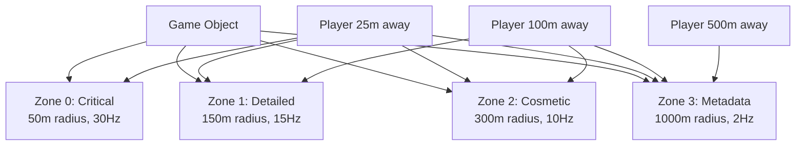
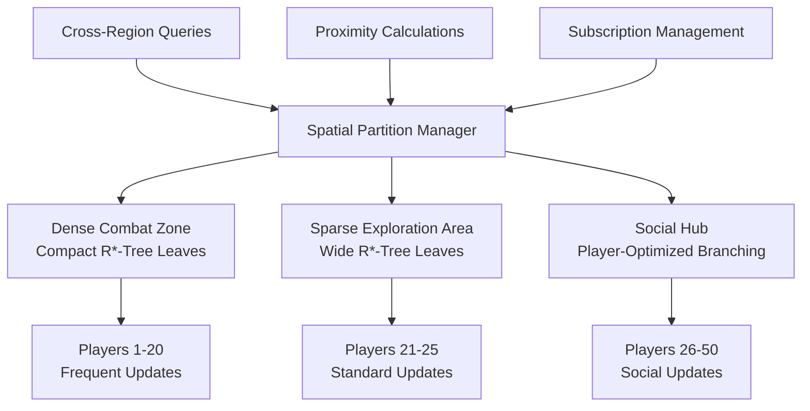

# GORC (Game Object Replication Channels)

GORC is an advanced replication system for multiplayer games that provides intelligent, zone-based object state distribution. Rather than broadcasting all object updates to all players, GORC creates dynamic subscription zones around each object instance, ensuring players receive exactly the information they need with optimal network efficiency.

## The Problem GORC Solves

Traditional multiplayer game servers face a fundamental challenge: how to keep thousands of players synchronized with a complex, ever-changing game world without overwhelming the network or degrading performance. Most solutions fall into two problematic extremes.

The naive approach broadcasts everything to everyone. When a player moves, every other player on the server receives an update, regardless of whether they're nearby or even care about that player. This quickly becomes untenable as player counts grow—a server with 1000 players would generate nearly a million position updates per second just for basic movement.

The overly restrictive approach limits information flow so aggressively that players miss important events. A distant explosion might not reach players who could see its effects, or a player might not receive updates about an enemy until they're close enough to collide.

GORC solves this by implementing intelligent, contextual replication. Each game object creates multiple concentric zones, each carrying different types of information at different frequencies. Critical gameplay data travels through small, high-frequency zones, while atmospheric information spreads through larger, lower-frequency zones. Players automatically subscribe and unsubscribe from these zones as they move through the world.



## Core Concepts

### Object Instances and Zones

In GORC, every replicated object in your game world becomes an independent instance with its own set of replication zones. These aren't static regions of the map—they're dynamic, object-centric areas that move with each object and respond to the object's current state and importance.

```rust
use horizon_event_system::*;

// Define a game object that participates in GORC
#[derive(Clone, Debug, Serialize, Deserialize)]
struct SpaceShip {
    position: Vec3,
    velocity: Vec3,
    health: f32,
    shield_energy: f32,
    pilot_name: String,
    ship_class: ShipClass,
    cargo: Vec<CargoItem>,
}

impl GorcObject for SpaceShip {
    fn type_name(&self) -> &str { "SpaceShip" }
    
    fn position(&self) -> Vec3 { self.position }
    
    fn get_layers(&self) -> Vec<ReplicationLayer> {
        vec![
            // Critical zone: Combat-relevant data for nearby players
            ReplicationLayer::new(0, 75.0, 20.0, 
                vec!["position".to_string(), "velocity".to_string(), "health".to_string()],
                CompressionType::Delta),
            
            // Detailed zone: Enhanced information for intermediate distances  
            ReplicationLayer::new(1, 200.0, 10.0,
                vec!["shield_energy".to_string(), "ship_class".to_string()],
                CompressionType::Lz4),
            
            // Metadata zone: Strategic information for long-range planning
            ReplicationLayer::new(3, 2000.0, 2.0,
                vec!["pilot_name".to_string()],
                CompressionType::High),
        ]
    }
    
    fn get_priority(&self, observer_pos: Vec3) -> ReplicationPriority {
        let distance = self.position.distance(observer_pos);
        match distance {
            d if d < 100.0 => ReplicationPriority::Critical,
            d if d < 500.0 => ReplicationPriority::High,
            d if d < 2000.0 => ReplicationPriority::Normal,
            _ => ReplicationPriority::Low,
        }
    }
    
    fn serialize_for_layer(&self, layer: &ReplicationLayer) -> Result<Vec<u8>, Box<dyn std::error::Error>> {
        let mut data = serde_json::Map::new();
        
        for property in &layer.properties {
            match property.as_str() {
                "position" => data.insert("position".to_string(), serde_json::to_value(&self.position)?),
                "velocity" => data.insert("velocity".to_string(), serde_json::to_value(&self.velocity)?),
                "health" => data.insert("health".to_string(), serde_json::to_value(self.health)?),
                "shield_energy" => data.insert("shield_energy".to_string(), serde_json::to_value(self.shield_energy)?),
                "pilot_name" => data.insert("pilot_name".to_string(), serde_json::to_value(&self.pilot_name)?),
                "ship_class" => data.insert("ship_class".to_string(), serde_json::to_value(&self.ship_class)?),
                _ => None,
            };
        }
        
        Ok(serde_json::to_vec(&data)?)
    }
    
    fn update_position(&mut self, new_position: Vec3) {
        self.position = new_position;
    }
    
    fn as_any(&self) -> &dyn Any { self }
    fn as_any_mut(&mut self) -> &mut dyn Any { self }
    fn clone_object(&self) -> Box<dyn GorcObject> { Box::new(self.clone()) }
}
```

Each object defines its own replication strategy through layers. A massive capital ship might have enormous zones that reach across entire star systems, while a small fighter's zones might only extend a few kilometers. The system automatically handles the complexity of managing thousands of these dynamic zones simultaneously.

### Channel-Based Information Flow

GORC organizes information into four distinct channels, each optimized for different types of data and update patterns:

**Channel 0 (Critical)** carries information that directly affects gameplay decisions and must be delivered immediately. Position updates, health changes, and collision states flow through this channel at high frequency with minimal latency. When a player fires a weapon or takes damage, other nearby players receive this information through Channel 0 within milliseconds.

**Channel 1 (Detailed)** handles important but non-critical information that enhances the gameplay experience. Animation states, weapon readiness indicators, and shield fluctuations travel through this channel at moderate frequency. This information helps players understand what's happening around them without overwhelming them with data.

**Channel 2 (Cosmetic)** focuses on visual and atmospheric effects that improve immersion but don't affect gameplay mechanics. Particle effects, visual enhancements, and decorative animations flow through this channel at lower frequency. When bandwidth is limited, the system can safely drop or delay these updates without impacting core gameplay.

**Channel 3 (Metadata)** carries informational data that changes infrequently but provides important context. Player names, faction affiliations, ship specifications, and achievement notifications use this channel. The low frequency allows for higher compression ratios and more complex data structures.

### Dynamic Subscription Management

The heart of GORC's efficiency lies in its dynamic subscription system. Rather than requiring developers to manually manage who receives what information, GORC automatically calculates subscriptions based on spatial relationships, social connections, and player interests.

```rust
#[tokio::main]
async fn main() -> Result<(), Box<dyn std::error::Error>> {
    // Create a complete GORC system
    let server_context = Arc::new(MyServerContext::new());
    let (events, mut gorc_system) = create_complete_horizon_system(server_context)?;
    
    // Register a spaceship
    let ship = SpaceShip {
        position: Vec3::new(1000.0, 500.0, 2000.0),
        velocity: Vec3::new(15.0, 0.0, -8.0),
        health: 100.0,
        shield_energy: 75.0,
        pilot_name: "Captain Reynolds".to_string(),
        ship_class: ShipClass::Firefly,
        cargo: vec![],
    };
    
    let ship_id = gorc_system.register_object(ship, Vec3::new(1000.0, 500.0, 2000.0)).await;
    
    // Add players at different distances
    let close_player = PlayerId::new();
    let distant_player = PlayerId::new();
    
    gorc_system.add_player(close_player, Vec3::new(1050.0, 500.0, 2000.0)).await;   // 50m away
    gorc_system.add_player(distant_player, Vec3::new(2000.0, 500.0, 2000.0)).await; // 1000m away
    
    // The system automatically determines subscriptions:
    // - close_player receives all channels (0, 1, 3) - within all zones
    // - distant_player receives only channel 3 (metadata) - only within metadata zone
    
    // Process one tick of replication
    gorc_system.tick().await?;
    
    Ok(())
}
```

The subscription system continuously adapts as players move through the world. When the close player moves away from the ship, they'll automatically unsubscribe from the critical and detailed channels but remain subscribed to metadata. This happens smoothly with hysteresis to prevent rapid flickering when players move along zone boundaries.

## Setting Up GORC

Getting started with GORC involves creating the system components and registering your game objects. The system is designed to integrate seamlessly with the Horizon Event System while providing its own specialized replication capabilities.

```rust
use horizon_event_system::*;

#[tokio::main]
async fn main() -> Result<(), Box<dyn std::error::Error>> {
    // Create server context (your implementation)
    let server_context = Arc::new(GameServerContext::new());
    
    // Create the complete GORC system with all components
    let (events, mut gorc_system) = create_complete_horizon_system(server_context)?;
    
    // The event system now has GORC integration
    events.on_gorc_instance("SpaceShip", 0, "position_update", 
        |event: GorcEvent, instance: &mut ObjectInstance| {
            if let Some(ship) = instance.get_object_mut::<SpaceShip>() {
                println!("Ship {} moved to {:?}", event.object_id, ship.position());
                // Update local game state, trigger effects, etc.
            }
            Ok(())
        }
    ).await?;
    
    // Register objects and start the game loop
    let ship_id = gorc_system.register_object(my_ship, initial_position).await;
    
    loop {
        // Process GORC replication
        gorc_system.tick().await?;
        
        // Handle game logic, player input, etc.
        
        tokio::time::sleep(tokio::time::Duration::from_millis(16)).await; // ~60 FPS
    }
}
```

The integration between GORC and the event system creates a powerful combination. Traditional events handle discrete occurrences like player actions or system notifications, while GORC handles continuous state synchronization of game objects. Together, they provide comprehensive communication infrastructure for complex multiplayer games.

## Advanced Object Patterns

GORC supports sophisticated object hierarchies and relationships that reflect the complexity of real game worlds. Different object types can have completely different replication strategies while still working together seamlessly.

### Environmental Objects

Large environmental objects like space stations or asteroid fields need different replication strategies than dynamic objects like ships:

```rust
#[derive(Clone, Debug, Serialize, Deserialize)]
struct SpaceStation {
    position: Vec3, // Stations don't move, but position is still needed for zone calculation
    shield_status: ShieldStatus,
    docking_bays: Vec<DockingBay>,
    population: u32,
    faction: Faction,
    services: Vec<Service>,
}

impl GorcObject for SpaceStation {
    fn get_layers(&self) -> Vec<ReplicationLayer> {
        vec![
            // Critical: Docking and shield information for approaching ships
            ReplicationLayer::new(0, 500.0, 5.0,
                vec!["shield_status".to_string(), "docking_bays".to_string()],
                CompressionType::Lz4),
            
            // Metadata: Station information for long-range navigation and planning
            ReplicationLayer::new(3, 10000.0, 0.5,
                vec!["population".to_string(), "faction".to_string(), "services".to_string()],
                CompressionType::High),
        ]
    }
    
    fn get_priority(&self, observer_pos: Vec3) -> ReplicationPriority {
        let distance = self.position.distance(observer_pos);
        // Stations are always important for navigation
        match distance {
            d if d < 1000.0 => ReplicationPriority::High,
            d if d < 5000.0 => ReplicationPriority::Normal,
            _ => ReplicationPriority::Low,
        }
    }
    
    // ... other implementations
}
```

Space stations use very different zone configurations than ships. They have larger zones because they're important for navigation across vast distances, but they update less frequently because their state changes slowly. The critical zone focuses on docking information that approaching ships need, while the metadata zone provides navigation and planning information across huge distances.

### Dynamic Object Scaling

GORC objects can dynamically adjust their replication strategies based on their current state. A ship that's docked might have very different replication needs than one engaged in combat:

```rust
impl GorcObject for SpaceShip {
    fn get_layers(&self) -> Vec<ReplicationLayer> {
        let base_layers = if self.is_docked() {
            // Docked ships need minimal replication
            vec![
                ReplicationLayer::new(3, 1000.0, 1.0,
                    vec!["pilot_name".to_string(), "ship_class".to_string()],
                    CompressionType::High),
            ]
        } else if self.is_in_combat() {
            // Combat ships need frequent, detailed updates
            vec![
                ReplicationLayer::new(0, 150.0, 30.0,
                    vec!["position".to_string(), "velocity".to_string(), "health".to_string(), "shield_energy".to_string()],
                    CompressionType::Delta),
                ReplicationLayer::new(1, 400.0, 15.0,
                    vec!["weapon_status".to_string(), "target_id".to_string()],
                    CompressionType::Lz4),
                ReplicationLayer::new(3, 2000.0, 2.0,
                    vec!["pilot_name".to_string(), "faction".to_string()],
                    CompressionType::High),
            ]
        } else {
            // Standard cruising configuration
            vec![
                ReplicationLayer::new(0, 75.0, 20.0,
                    vec!["position".to_string(), "velocity".to_string(), "health".to_string()],
                    CompressionType::Delta),
                ReplicationLayer::new(1, 200.0, 10.0,
                    vec!["ship_class".to_string()],
                    CompressionType::Lz4),
                ReplicationLayer::new(3, 2000.0, 2.0,
                    vec!["pilot_name".to_string()],
                    CompressionType::High),
            ]
        };
        
        base_layers
    }
    
    fn is_docked(&self) -> bool {
        // Check if ship is currently docked at a station
        self.docking_status == DockingStatus::Docked
    }
    
    fn is_in_combat(&self) -> bool {
        // Check if ship is actively engaged in combat
        self.last_combat_action.map(|time| time.elapsed() < Duration::from_secs(30)).unwrap_or(false)
    }
}
```

This dynamic scaling ensures that network resources are used efficiently. Docked ships consume minimal bandwidth, while ships in active combat receive the detailed, high-frequency updates needed for responsive gameplay.

## Network Optimization and Performance

GORC includes sophisticated network optimization features that automatically adapt to changing conditions and player distributions. The system continuously monitors performance and adjusts its behavior to maintain optimal player experience.

### Intelligent Batching and Compression

Rather than sending individual updates for each object change, GORC batches related updates together and applies appropriate compression based on the data type and network conditions:

```rust
// GORC automatically batches updates for efficient transmission
let network_config = NetworkConfig {
    max_bandwidth_per_player: 512 * 1024, // 512 KB/s per player
    max_batch_size: 25,                   // Up to 25 updates per batch
    max_batch_age_ms: 16,                 // Force send after 16ms (~60 FPS)
    compression_enabled: true,
    compression_threshold: 128,           // Compress payloads larger than 128 bytes
    target_frequencies: {
        let mut freq = HashMap::new();
        freq.insert(0, 30.0); // Critical - 30Hz
        freq.insert(1, 15.0); // Detailed - 15Hz
        freq.insert(2, 10.0); // Cosmetic - 10Hz
        freq.insert(3, 2.0);  // Metadata - 2Hz
        freq
    },
    // ... other configuration
};
```

The batching system groups updates by player and priority, ensuring that critical updates are never delayed by lower-priority data. Compression algorithms are chosen based on the data characteristics—position data uses delta compression to send only changes, while complex metadata uses general-purpose compression for maximum efficiency.

### Adaptive Quality Scaling

When network conditions degrade or player counts increase beyond expected levels, GORC can automatically reduce quality to maintain responsiveness:

```rust
// Monitor system performance and adapt automatically
let performance_report = gorc_system.get_performance_report().await;

if performance_report.network_utilization > 0.8 {
    println!("High network utilization detected: {:.1}%", 
             performance_report.network_utilization * 100.0);
    
    // GORC automatically reduces update frequencies and applies more aggressive compression
    // Channels scale down gracefully: 30Hz -> 20Hz -> 15Hz -> 10Hz
    // Critical channels are protected and scale down last
}

if !performance_report.is_healthy() {
    println!("System health issues detected:");
    for issue in &performance_report.issues {
        println!("  - {}", issue);
    }
    
    // Get actionable recommendations
    for recommendation in performance_report.get_recommendations() {
        println!("Recommendation: {}", recommendation);
    }
}
```

The adaptive system preserves gameplay quality by reducing cosmetic and metadata updates before touching critical gameplay information. Players might see fewer particle effects or less frequent name updates, but position synchronization and combat data remain responsive.

## Spatial Intelligence and Awareness

GORC's spatial management system goes beyond simple distance calculations to provide sophisticated awareness of player relationships and movement patterns. The system builds spatial intelligence that helps predict what information players will need before they explicitly need it.

### Multi-Layered Spatial Indexing

The spatial partitioning system is backed by adaptive R*-trees that automatically adjust their leaf occupancy based on player density and object distribution:



In areas with many players fighting, the R*-tree naturally keeps leaves small to enable fast proximity queries without deep recursion. In empty space, broader leaves reduce memory overhead and query fan-out. Social areas like stations balance branch factors to stay responsive even with frequent small movements.

### Predictive Subscription Management

The system learns from player movement patterns to predict future subscription needs:

```rust
// GORC tracks player movement to predict future subscriptions
let subscription_manager = SubscriptionManager::new();

// Add players with movement tracking
subscription_manager.add_player(player_id, initial_position).await;

// As players move, the system learns their patterns
subscription_manager.update_player_position(player_id, new_position).await;

// The system can predict likely future positions and pre-subscribe to relevant zones
// This reduces the latency when players move into new areas
```

When a player has been moving steadily in one direction, GORC can begin subscribing them to zones they're likely to enter soon. This predictive capability reduces the perceived latency of information delivery as players explore new areas.

### Social Relationship Integration

GORC understands that multiplayer games are fundamentally social experiences, and incorporates social relationships into its replication decisions:

```rust
// Enhanced subscriptions based on social relationships
subscription_manager.add_relationship(
    player_id,
    "team".to_string(),
    vec![teammate1_id, teammate2_id, teammate3_id],
).await;

// Team members receive enhanced updates regardless of distance
// This ensures team coordination remains effective even when spread across large areas

subscription_manager.add_relationship(
    player_id,
    "guild".to_string(),
    guild_member_ids,
).await;

// Guild members get enhanced metadata updates for social features
// Names, achievements, and status information propagate more reliably
```

Social relationships override pure distance-based calculations. Team members receive critical updates about each other across much larger distances than strangers. Guild members see enhanced social information that helps maintain community bonds even in large game worlds.

## Event System Integration

GORC's integration with the Horizon Event System creates a comprehensive communication infrastructure that handles both discrete events and continuous state synchronization. This integration enables sophisticated gameplay patterns that wouldn't be possible with either system alone.

### Instance-Specific Event Handling

The event system can target specific object instances, allowing for precise event delivery and object-specific behavior:

```rust
// Register handlers that have direct access to object instances
events.on_gorc_instance("SpaceShip", 0, "collision_detected", 
    |event: GorcEvent, ship_instance: &mut ObjectInstance| {
        if let Some(ship) = ship_instance.get_object_mut::<SpaceShip>() {
            // Direct access to the ship object for immediate response
            ship.apply_collision_damage(event.collision_force);
            ship.trigger_emergency_systems();
            
            // Update physics state immediately
            ship.velocity = ship.velocity * 0.5; // Reduce velocity after collision
            
            println!("Ship {} took collision damage: {} hull integrity remaining", 
                     event.object_id, ship.health);
        }
        Ok(())
    }
).await?;

// Emit events for specific object instances
events.emit_gorc_instance(ship_id, 0, "collision_detected", &GorcEvent {
    object_id: ship_id.to_string(),
    object_type: "SpaceShip".to_string(),
    channel: 0,
    data: serde_json::to_vec(&collision_data)?,
    priority: "Critical".to_string(),
    timestamp: current_timestamp(),
}).await?;
```

This pattern enables immediate, local responses to events while still broadcasting the information to other relevant systems. The collision handler can instantly update the ship's state while other systems receive the event for their own processing needs.

### Cross-System Event Propagation

Events can flow seamlessly between the traditional event system and GORC, enabling complex interactions between discrete actions and continuous state:

```rust
// Traditional event triggers GORC state changes
events.on_client("weapons", "fire_torpedo", |event: RawClientMessageEvent| {
    let torpedo_data = parse_torpedo_launch(&event.data)?;
    
    // Create a new torpedo object in GORC
    let torpedo = Torpedo::new(torpedo_data.position, torpedo_data.target);
    let torpedo_id = gorc_system.register_object(torpedo, torpedo_data.position).await;
    
    // Emit GORC event for the torpedo launch
    events.emit_gorc_instance(torpedo_id, 0, "torpedo_launched", &GorcEvent {
        object_id: torpedo_id.to_string(),
        object_type: "Torpedo".to_string(),
        channel: 0,
        data: serde_json::to_vec(&torpedo_data)?,
        priority: "Critical".to_string(),
        timestamp: current_timestamp(),
    }).await?;
    
    Ok(())
}).await?;

// GORC events can trigger traditional events
events.on_gorc_instance("Torpedo", 0, "impact_detected", 
    |event: GorcEvent, torpedo_instance: &mut ObjectInstance| {
        // Process the impact through traditional event system
        let explosion_event = ExplosionEvent {
            position: torpedo_instance.object.position(),
            blast_radius: 100.0,
            damage: 50.0,
            timestamp: current_timestamp(),
        };
        
        // Note: In actual implementation, you'd need to emit this through 
        // the event system reference, which would require additional architecture
        println!("Torpedo {} exploded at {:?}", event.object_id, explosion_event.position);
        
        Ok(())
    }
).await?;
```

This seamless integration means that developers can choose the right communication pattern for each situation without being locked into a single approach.

## Performance Monitoring and Optimization

GORC provides comprehensive monitoring tools that help developers understand system behavior and optimize performance for their specific use cases. The monitoring system tracks everything from network utilization to spatial query performance, providing actionable insights for optimization.

### Real-Time Performance Metrics

The system continuously collects detailed metrics about all aspects of its operation:

```rust
// Monitor the complete GORC system performance
let monitor = HorizonMonitor::with_gorc(events.clone(), Arc::new(gorc_system.clone()));

// Generate comprehensive performance reports
let report = monitor.generate_report().await;

println!("System Health Score: {:.1}/10", report.system_health * 10.0);
if let Some(gorc_perf) = &report.gorc_performance {
    println!("Network Utilization: {:.1}%", gorc_perf.network_utilization * 100.0);
    println!("Active Objects: {}", gorc_perf.total_objects);
    println!("Total Subscriptions: {}", gorc_perf.total_subscriptions);
}

// Check for performance issues
if let Some(gorc_perf) = &report.gorc_performance {
    if gorc_perf.updates_dropped > 0 {
        println!("Warning: {} updates were dropped due to bandwidth limits", gorc_perf.updates_dropped);
    }
    
    if gorc_perf.avg_batch_size < 5.0 {
        println!("Info: Low batch efficiency - consider adjusting batch size limits");
    }
}

// Get specific recommendations for improvement
if !report.is_healthy() {
    println!("System recommendations:");
    for recommendation in report.get_recommendations() {
        println!("  - {}", recommendation);
    }
}
```

The monitoring system tracks dozens of metrics across all subsystems, from low-level network statistics to high-level gameplay metrics. This comprehensive view helps developers identify bottlenecks and optimization opportunities that might not be obvious from looking at individual components.

### Automated Performance Tuning

GORC can automatically adjust its behavior based on observed performance characteristics:

```rust
// Configure automatic performance tuning
let mut gorc_config = GorcConfig {
    adaptive_frequency: true,        // Automatically adjust update frequencies
    load_threshold: 0.8,            // Start optimizations at 80% capacity
    max_total_bandwidth: 100 * 1024 * 1024, // 100 MB/s total
    default_compression_enabled: true,
    adaptive_scale_factor: 0.2,     // How aggressively to scale under load
    // ... other settings
};

// The system monitors its own performance and adapts
loop {
    gorc_system.tick().await?;
    
    // Automatic optimization happens internally
    // Frequencies may be reduced, compression increased, or zones resized
    // based on current performance characteristics
    
    tokio::time::sleep(Duration::from_millis(16)).await;
}
```

The automatic tuning system makes gradual adjustments to maintain stable performance as conditions change. Rather than requiring manual intervention when player counts spike or network conditions degrade, GORC smoothly adapts its behavior to maintain the best possible player experience within available resources.

## Advanced Use Cases and Patterns

GORC's flexible architecture supports sophisticated gameplay patterns that would be difficult or impossible to implement with traditional replication systems. These advanced patterns showcase the system's ability to handle complex, real-world game requirements.

### Large-Scale Battle Scenarios

In massive multiplayer battles with hundreds of participants, GORC can dynamically adjust replication strategies to maintain performance while preserving gameplay quality:

```rust
// Battle-optimized object configuration
impl GorcObject for BattleCruiser {
    fn get_layers(&self) -> Vec<ReplicationLayer> {
        let player_count_nearby = self.estimate_nearby_players();
        
        if player_count_nearby > 50 {
            // High-density battle configuration: shorter ranges, lower frequencies
            vec![
                ReplicationLayer::new(0, 100.0, 15.0,  // Reduced from 30Hz to 15Hz
                    vec!["position".to_string(), "health".to_string()],
                    CompressionType::Delta),
                ReplicationLayer::new(3, 1000.0, 1.0,  // Reduced metadata updates
                    vec!["captain_name".to_string()],
                    CompressionType::High),
            ]
        } else {
            // Standard configuration for smaller engagements
            vec![
                ReplicationLayer::new(0, 200.0, 30.0,
                    vec!["position".to_string(), "health".to_string(), "shield_status".to_string()],
                    CompressionType::Delta),
                ReplicationLayer::new(1, 500.0, 15.0,
                    vec!["weapon_systems".to_string(), "crew_status".to_string()],
                    CompressionType::Lz4),
                ReplicationLayer::new(3, 2000.0, 2.0,
                    vec!["captain_name".to_string(), "fleet_affiliation".to_string()],
                    CompressionType::High),
            ]
        }
    }
}
```

This adaptive configuration ensures that large battles remain playable by automatically reducing the information density when many players are present, while providing rich detail during smaller engagements.

### Persistent World Streaming

For games with vast, persistent worlds, GORC can stream content dynamically as players explore:

```rust
// Region-based content streaming
struct GalaxyRegion {
    region_id: RegionId,
    star_systems: Vec<StarSystem>,
    trade_routes: Vec<TradeRoute>,
    points_of_interest: Vec<PointOfInterest>,
}

impl GorcObject for GalaxyRegion {
    fn get_layers(&self) -> Vec<ReplicationLayer> {
        vec![
            // Critical: Navigation hazards and immediate threats
            ReplicationLayer::new(0, 1000.0, 5.0,
                vec!["navigation_hazards".to_string(), "active_conflicts".to_string()],
                CompressionType::Lz4),
            
            // Metadata: Rich world information for exploration
            ReplicationLayer::new(3, 50000.0, 0.1,  // Very large radius, very low frequency
                vec!["star_systems".to_string(), "trade_routes".to_string(), "points_of_interest".to_string()],
                CompressionType::High),
        ]
    }
    
    fn get_priority(&self, observer_pos: Vec3) -> ReplicationPriority {
        // Regions are always low priority but cover huge areas
        ReplicationPriority::Low
    }
}
```

Galaxy regions use extremely large metadata zones that can span light-years, providing exploration information across vast distances while using minimal bandwidth through very low update frequencies and aggressive compression.

### Social and Economic Systems

GORC excels at managing complex social and economic interactions that span different scales and timeframes:

```rust
// Market hub with dynamic information flow
struct TradingHub {
    position: Vec3,
    active_markets: Vec<Market>,
    price_trends: HashMap<String, PriceTrend>,
    trader_reputations: HashMap<PlayerId, TraderReputation>,
    recent_transactions: Vec<Transaction>,
}

impl GorcObject for TradingHub {
    fn get_layers(&self) -> Vec<ReplicationLayer> {
        vec![
            // Critical: Real-time market data for active traders
            ReplicationLayer::new(0, 500.0, 10.0,
                vec!["active_markets".to_string(), "recent_transactions".to_string()],
                CompressionType::Lz4),
            
            // Metadata: Economic intelligence for strategic planning
            ReplicationLayer::new(3, 10000.0, 1.0,
                vec!["price_trends".to_string(), "trader_reputations".to_string()],
                CompressionType::High),
        ]
    }
}
```

Trading hubs provide real-time market data to nearby traders while broadcasting economic intelligence across large regions for strategic planning. The system automatically balances the need for immediate market information with the broader economic context that affects long-term decisions.

## Integration and Deployment

GORC is designed to integrate smoothly with existing game server architectures while providing clear migration paths for projects that want to adopt its advanced features gradually.

### Hybrid Deployment Strategies

You can start using GORC for specific object types while keeping existing replication systems for others:

```rust
// Gradually migrate to GORC object by object
let (events, mut gorc_system) = create_complete_horizon_system(server_context)?;

// Use GORC for dynamic objects that benefit from zone-based replication
let ship_id = gorc_system.register_object(my_spaceship, ship_position).await;
let station_id = gorc_system.register_object(my_station, station_position).await;

// Keep using traditional events for discrete actions
events.on_client("actions", "dock_request", |event: RawClientMessageEvent| {
    handle_docking_request(event.player_id, &event.data).await?;
    Ok(())
}).await?;

// Bridge between systems as needed - note: this requires additional architecture
// to access gorc_system from within event handlers
events.on_plugin("docking", "dock_completed", |event: DockCompletedEvent| {
    // In a real implementation, you'd need to pass gorc_system reference
    println!("Dock completed for ship {}", event.ship_id);
    Ok(())
}).await?;
```

This hybrid approach allows teams to gain experience with GORC's benefits while minimizing disruption to existing systems. Objects can be migrated to GORC one at a time as developers become comfortable with the new patterns.

### Production Deployment Considerations

GORC includes features specifically designed for production deployment and operations:

```rust
// Production configuration with monitoring and alerting
let production_config = NetworkConfig {
    max_bandwidth_per_player: 256 * 1024,  // Conservative bandwidth limits
    max_batch_size: 30,
    compression_enabled: true,
    compression_threshold: 64,              // Aggressive compression
    adaptive_frequency: true,               // Enable automatic optimization
    // ... other production settings
};

// Set up monitoring and alerting
let monitor = HorizonMonitor::with_gorc(events.clone(), gorc_system.clone());

tokio::spawn(async move {
    loop {
        tokio::time::sleep(Duration::from_secs(60)).await;
        
        let alerts = monitor.should_alert().await;
        if !alerts.is_empty() {
            for alert in alerts {
                send_alert_to_operations_team(&alert).await;
            }
        }
        
        let report = monitor.generate_report().await;
        log_performance_metrics(&report).await;
    }
});
```

The monitoring and alerting system helps operations teams identify issues before they affect players, while the automatic optimization features help maintain stable performance even under unexpected load conditions.

## Future Possibilities

GORC's architecture is designed to evolve with advancing technology and changing game development needs. The system's modular design and clean interfaces make it possible to add new capabilities without disrupting existing functionality.

The spatial intelligence system could be enhanced with machine learning capabilities that predict player behavior patterns and optimize replication strategies automatically. Advanced compression techniques could reduce bandwidth requirements further while maintaining information fidelity. Cross-server replication could enable truly massive game worlds that span multiple physical servers seamlessly.

The event system integration could be extended to support more sophisticated event routing patterns, enabling complex distributed game logic that spans multiple servers or even multiple game worlds. Enhanced social awareness could create replication strategies that adapt to player community structures and interaction patterns in real-time.