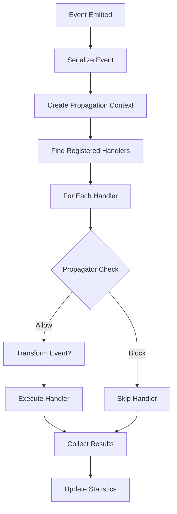

# Architecture Overview

The Universal Plugin System is built around several core concepts that work together to provide a flexible, type-safe, and high-performance plugin architecture.

## Core Components

### Event Bus
The central hub for all event routing and handling. It manages:
- Event registration and subscription
- Event propagation to interested handlers
- Statistics and monitoring
- Type safety and error handling

### Event Propagator
Determines which handlers receive which events. Different propagators enable:
- **AllEq**: Exact key matching (most common)
- **Spatial**: Distance-based filtering for games
- **Network**: Network topology-aware routing
- **Custom**: Your own propagation logic

### Plugin Manager
Handles the plugin lifecycle:
- Dynamic plugin loading/unloading
- Version compatibility checking
- Plugin initialization and shutdown
- Memory safety and panic isolation

### Plugin Context
Provides dependency injection for plugins:
- Shared services and resources
- Configuration management
- Inter-plugin communication

## Design Principles

### 1. Type Safety First
Everything is designed to catch errors at compile time rather than runtime:

```rust
// Compile-time guarantees
event_bus.on_key(key, |event: MyEvent| { // Type checked
    // Handler knows exact event type
    Ok(())
}).await?;

// No runtime type casting or string matching needed
```

### 2. Zero-Copy Event Routing
Events are serialized once and shared via `Arc<EventData>`:

```rust
pub struct EventData {
    pub data: Arc<Vec<u8>>,        // Shared, not copied
    pub type_name: String,         // For type checking
    pub metadata: HashMap<String, String>, // Additional context
}
```

### 3. Structured Event Keys
No string parsing - events are routed using structured keys:

```rust
// Old way: "client:chat:message" (string parsing)
// New way: 
StructuredEventKey::Client {
    namespace: "chat".into(),
    event_name: "message".into()
} // No parsing, just field access
```

### 4. Configurable Propagation
Different applications need different routing logic:

```rust
// Game server: spatial propagation
let spatial = SpatialPropagator::new(100.0); // 100 unit radius
let event_bus = EventBus::with_propagator(spatial);

// Web app: exact matching
let exact = AllEqPropagator::new();
let event_bus = EventBus::with_propagator(exact);

// Complex: combine multiple
let composite = CompositePropagator::new_and()
    .add_propagator(Box::new(AllEqPropagator::new()))
    .add_propagator(Box::new(NamespacePropagator::new()));
```

## Event Flow

Here's how events flow through the system:



### Step-by-Step Breakdown

1. **Event Emission**: Application emits event with structured key
2. **Serialization**: Event is serialized once to `EventData`
3. **Handler Lookup**: Find all handlers registered for that key type
4. **Propagation Check**: For each handler, ask propagator if it should receive event
5. **Event Transform**: Optionally transform event data (e.g., add distance info)
6. **Handler Execution**: Execute all allowed handlers concurrently
7. **Result Collection**: Gather results and update statistics

## Memory Management

### Plugin Isolation
Each plugin runs in its own isolated context:

```rust
// Plugin boundaries are FFI-safe
#[no_mangle]
pub extern "C" fn create_plugin() -> *mut dyn Plugin {
    // Panic isolation - plugin crashes don't crash host
    std::panic::catch_unwind(|| {
        Box::into_raw(Box::new(MyPlugin::new()))
    }).unwrap_or(std::ptr::null_mut())
}
```

### Event Data Sharing
Events are shared, not copied:

```rust
// One allocation, many readers
let event_data = Arc::new(EventData::new(&my_event)?);

// All handlers get same Arc - no copying
for handler in handlers {
    let data_clone = event_data.clone(); // Just increments ref count
    handler.handle(&data_clone).await?;
}
```

### Resource Management
Plugins clean up automatically:

```rust
impl Drop for LoadedPlugin {
    fn drop(&mut self) {
        // Automatic cleanup when plugin is unloaded
        self.shutdown().await.ok();
    }
}
```

## Type System

### Event Key Types
The system is generic over event key types:

```rust
pub trait EventKeyType: 
    Clone + PartialEq + Eq + Hash + Send + Sync + Debug + 'static 
{
    fn to_string(&self) -> String;
}

// Use any type that implements EventKeyType
pub struct EventBus<K: EventKeyType, P: EventPropagator<K>> {
    // ...
}
```

### Event Propagators
Propagators are also generic and composable:

```rust
#[async_trait]
pub trait EventPropagator<K: EventKeyType>: Send + Sync + 'static {
    async fn should_propagate(&self, event_key: &K, context: &PropagationContext<K>) -> bool;
    
    async fn transform_event(
        &self, 
        event: Arc<EventData>, 
        context: &PropagationContext<K>
    ) -> Option<Arc<EventData>> {
        Some(event) // Default: no transformation
    }
}
```

## Performance Characteristics

### Event Routing: O(1)
Events are routed using hash maps:

```rust
// O(1) lookup by event key
handlers: DashMap<K, SmallVec<[Arc<dyn EventHandler>; 4]>>
```

### Handler Execution: Concurrent
All handlers run in parallel:

```rust
// Execute all handlers concurrently
let mut futures = FuturesUnordered::new();
for handler in handlers {
    futures.push(async move {
        handler.handle(&event_data).await
    });
}

// Collect results as they complete
while let Some(result) = futures.next().await {
    // Handle result
}
```

### Memory Usage: Optimized
- Events serialized once, shared via `Arc`
- Small vectors for handler lists (most events have 1-4 handlers)
- Compact strings for reduced allocations
- Lock-free data structures where possible

## Error Handling

### Panic Isolation
Plugin failures don't crash the host:

```rust
// Plugin execution is isolated
let result = std::panic::catch_unwind(AssertUnwindSafe(|| {
    plugin.handle_event(&event)
}));

match result {
    Ok(Ok(())) => { /* Success */ }
    Ok(Err(e)) => { /* Plugin error */ }
    Err(_) => { /* Plugin panicked */ }
}
```

### Graceful Degradation
Failed handlers don't stop event processing:

```rust
// If one handler fails, others still execute
for handler in handlers {
    if let Err(e) = handler.handle(&event).await {
        error!("Handler {} failed: {}", handler.name(), e);
        // Continue with other handlers
    }
}
```

### Error Propagation
Errors are collected and reported:

```rust
pub struct EventStats {
    pub events_emitted: u64,
    pub events_handled: u64,
    pub handler_failures: u64,  // Track failures
    pub total_handlers: usize,
}
```

## Thread Safety

### Lock-Free Where Possible
- `DashMap` for lock-free handler registration
- `Arc` for shared ownership without locks
- Atomic counters for statistics

### Async Throughout
Everything is designed for async operation:

```rust
#[async_trait]
pub trait EventHandler: Send + Sync {
    async fn handle(&self, event: &EventData) -> Result<(), EventError>;
}

#[async_trait]
pub trait EventPropagator<K: EventKeyType>: Send + Sync + 'static {
    async fn should_propagate(&self, event_key: &K, context: &PropagationContext<K>) -> bool;
}
```

## Extension Points

### Custom Event Keys
Define your own event key types:

```rust
#[derive(Debug, Clone, Hash, PartialEq, Eq)]
pub enum MyEventKey {
    Database { table: String, operation: String },
    Network { protocol: String, endpoint: String },
    Custom(String),
}

impl EventKeyType for MyEventKey {
    fn to_string(&self) -> String {
        match self {
            MyEventKey::Database { table, operation } => 
                format!("db:{}:{}", table, operation),
            MyEventKey::Network { protocol, endpoint } => 
                format!("net:{}:{}", protocol, endpoint),
            MyEventKey::Custom(s) => s.clone(),
        }
    }
}
```

### Custom Propagators
Implement your own propagation logic:

```rust
pub struct DatabasePropagator {
    allowed_tables: HashSet<String>,
}

#[async_trait]
impl EventPropagator<MyEventKey> for DatabasePropagator {
    async fn should_propagate(&self, event_key: &MyEventKey, _context: &PropagationContext<MyEventKey>) -> bool {
        match event_key {
            MyEventKey::Database { table, .. } => 
                self.allowed_tables.contains(table),
            _ => true, // Allow non-database events
        }
    }
}
```

### Context Providers
Add your own services to plugin contexts:

```rust
pub struct DatabaseProvider {
    connection_pool: DatabasePool,
}

#[async_trait]
impl ContextProvider<MyEventKey, MyPropagator> for DatabaseProvider {
    async fn provide(&self, context: &mut PluginContext<MyEventKey, MyPropagator>) {
        context.insert("database", self.connection_pool.clone());
    }
}
```

This architecture provides maximum flexibility while maintaining type safety and performance.