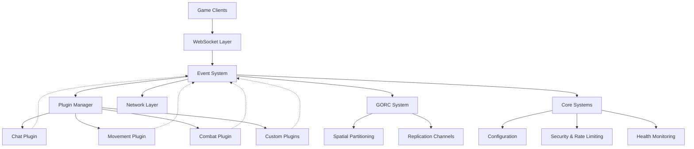
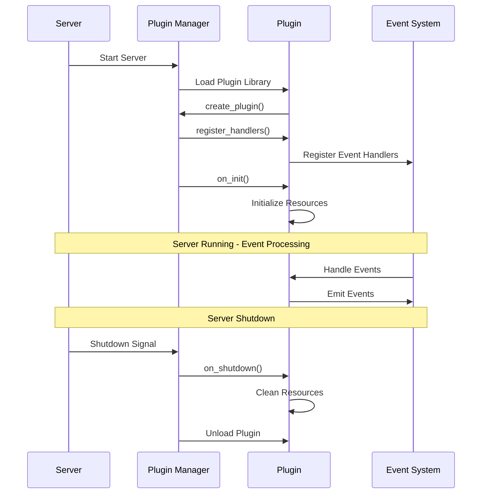
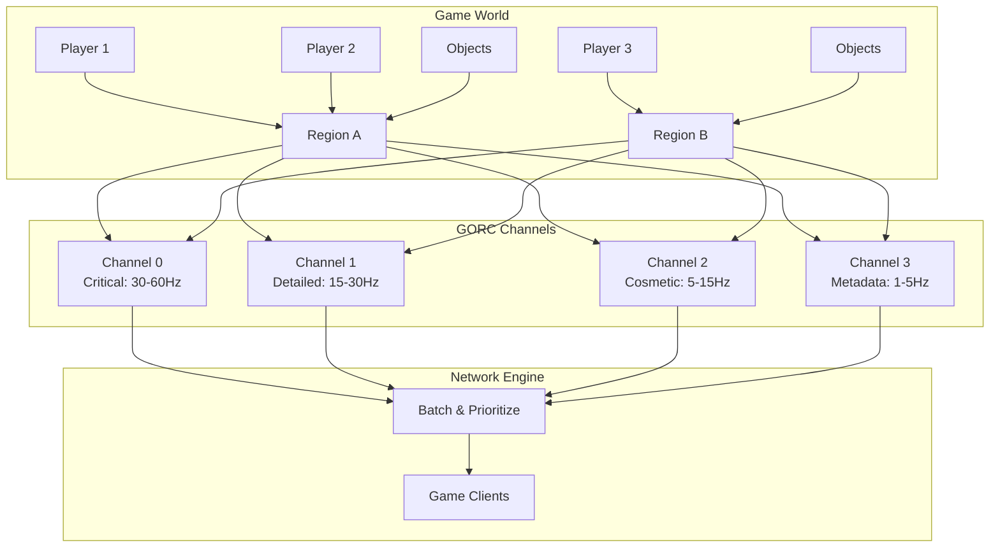
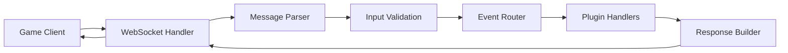

# Horizon Game Server Architecture

Horizon is a high-performance, modular game server built in Rust that separates infrastructure concerns from game logic through a sophisticated plugin system. This architecture guide provides an in-depth look at how the components work together to create scalable multiplayer experiences.

## System Overview



The architecture consists of four main layers that handle different aspects of multiplayer game servers:

- **Network Layer** handles WebSocket connections, message parsing, and client communication
- **Event System** provides type-safe routing between components with four event categories
- **Plugin System** enables hot-reloadable game logic through dynamic libraries
- **GORC System** manages real-time object replication with spatial optimization

## Core Components Deep Dive

### Event System Architecture 

The `EventSystem` is the central communication hub that routes messages between all components. It's implemented in `crates/horizon_event_system/src/system/mod.rs` and provides four distinct event categories:

```rust
// From the actual codebase - lib.rs
pub use events::{
    Event, EventError, EventHandler, GorcEvent,
    PlayerConnectedEvent, PlayerDisconnectedEvent,
    RawClientMessageEvent, RegionStartedEvent,
    RegionStoppedEvent, TypedEventHandler,
    PluginLoadedEvent, PluginUnloadedEvent,
    AuthenticationStatusSetEvent,
    AuthenticationStatusGetEvent, AuthenticationStatusGetResponseEvent,
    AuthenticationStatusChangedEvent,
};
```

#### Event Categories

**Core Events** (`core:*`) - Server infrastructure events:
```rust
// Example from greeter plugin
register_handlers!(events; core {
    "player_connected" => |event: serde_json::Value| {
        println!("👋 GreeterPlugin: New player connected! {:?}", event);
        Ok(())
    },
    "player_disconnected" => |event: serde_json::Value| {
        println!("👋 GreeterPlugin: Player disconnected. Farewell! {:?}", event);
        Ok(())
    }
})?;
```

**Client Events** (`client:namespace:event`) - Messages from game clients:
```rust
// Example client event handling from greeter plugin
register_handlers!(events; client {
    "chat", "message" => |event: PlayerChatEvent| {
        println!("👋 GreeterPlugin: Player {} said: '{}' in {}",
                 event.player_id, event.message, event.channel);
        Ok(())
    },
    "movement", "jump" => |event: PlayerJumpEvent| {
        println!("👋 GreeterPlugin: Player {} jumped {:.1}m high! 🦘",
                 event.player_id, event.height);
        Ok(())
    }
})?;
```

**Plugin Events** (`plugin:plugin_name:event`) - Inter-plugin communication:
```rust
// Example plugin-to-plugin communication
events.emit_plugin(
    "InventorySystem",
    "PickupItem",
    &serde_json::json!({
        "id": "701d617f-3e4f-41b4-b4c6-c1b53709fc63",
        "item_count": 5,
        "item_id": 42
    }),
).await?;
```

**GORC Events** (`gorc:object_type:channel:event`) - Object replication events:
```rust
// Example GORC instance handler
events.on_gorc_instance("Asteroid", 0, "position_update", 
    |event: GorcEvent, instance: &mut ObjectInstance| {
        if let Some(asteroid) = instance.get_object_mut::<ExampleAsteroid>() {
            println!("Asteroid {} moved to {:?}", event.object_id, asteroid.position());
        }
        Ok(())
    }
).await?;
```

### Plugin System Implementation

The plugin system enables hot-reloadable game logic through dynamic libraries. Plugins implement the `SimplePlugin` trait from `crates/horizon_event_system/src/plugin.rs`:

```rust
#[async_trait]
pub trait SimplePlugin: Send + Sync + 'static {
    fn name(&self) -> &str;
    fn version(&self) -> &str;
    
    async fn register_handlers(
        &mut self, 
        events: Arc<EventSystem>, 
        context: Arc<dyn ServerContext>
    ) -> Result<(), PluginError>;
    
    async fn on_init(&mut self, context: Arc<dyn ServerContext>) -> Result<(), PluginError>;
    async fn on_shutdown(&mut self, context: Arc<dyn ServerContext>) -> Result<(), PluginError>;
}
```

#### Plugin Lifecycle



#### Real Plugin Example

Here's the actual structure from `crates/plugin_greeter/src/lib.rs`:

```rust
pub struct GreeterPlugin {
    name: String,
    welcome_count: u32,
}

impl GreeterPlugin {
    pub fn new() -> Self {
        println!("🎉 GreeterPlugin: Creating new instance");
        Self {
            name: "greeter".to_string(),
            welcome_count: 0,
        }
    }
}

#[async_trait]
impl SimplePlugin for GreeterPlugin {
    fn name(&self) -> &str { &self.name }
    fn version(&self) -> &str { "1.0.0" }

    async fn register_handlers(
        &mut self, 
        events: Arc<EventSystem>, 
        context: Arc<dyn ServerContext>
    ) -> Result<(), PluginError> {
        // Handler registration using the register_handlers! macro
        register_handlers!(events; core {
            "player_connected" => |event: serde_json::Value| {
                println!("👋 GreeterPlugin: New player connected! {:?}", event);
                Ok(())
            }
        })?;
        Ok(())
    }
}

// Creates the FFI interface automatically
create_simple_plugin!(GreeterPlugin);
```

### GORC System Architecture

The Game Object Replication Channels (GORC) system manages real-time object synchronization. It's implemented across multiple modules in `crates/horizon_event_system/src/gorc/`:

```rust
// From gorc/mod.rs - Core GORC exports
pub use channels::{
    ReplicationChannel, ReplicationLayer, ReplicationLayers, ReplicationPriority, 
    CompressionType, GorcManager, MineralType, Replication, GorcObjectRegistry,
    GorcConfig, GorcStats, PerformanceReport, GorcError
};

pub use instance::{
    GorcObject, GorcObjectId, ObjectInstance, GorcInstanceManager, 
    InstanceManagerStats, ObjectStats
};

pub use zones::{
    ObjectZone, ZoneManager, ZoneAnalysis, ZoneConfig, ZoneStats,
    AdvancedZoneManager, ZonePerformanceMetrics
};
```

#### GORC System Flow



#### GORC Usage Example

```rust
// From lib.rs quick start example
#[tokio::main]
async fn main() -> Result<(), Box<dyn std::error::Error>> {
    // Create the complete GORC system
    let server_context = Arc::new(MyServerContext);
    let (events, mut gorc_system) = create_complete_horizon_system(server_context)?;
    
    // Register GORC instance handlers with object access
    events.on_gorc_instance("Asteroid", 0, "position_update", 
        |event: GorcEvent, instance: &mut ObjectInstance| {
            if let Some(asteroid) = instance.get_object_mut::<ExampleAsteroid>() {
                println!("Asteroid {} moved to {:?}", event.object_id, asteroid.position());
            }
            Ok(())
        }
    ).await?;
    
    // Register game objects
    let asteroid = ExampleAsteroid::new(Vec3::new(100.0, 0.0, 200.0), MineralType::Platinum);
    let asteroid_id = gorc_system.register_object(asteroid, Vec3::new(100.0, 0.0, 200.0)).await;
    
    // Add players
    let player1_id = PlayerId::new();
    gorc_system.add_player(player1_id, Vec3::new(50.0, 0.0, 180.0)).await;
    
    // Main game loop
    loop {
        gorc_system.tick().await?;
        tokio::time::sleep(tokio::time::Duration::from_millis(16)).await; // ~60 FPS
    }
}
```

### Network Layer Architecture

The network layer is implemented in `crates/game_server/src/` and handles WebSocket connections, message routing, and client management:

```rust
// From game_server/src/connection/mod.rs - Connection management
pub mod client;
pub mod manager;
pub mod response;

// Connection flow
pub struct ConnectionManager {
    // Handles multiple concurrent connections
    // Implements rate limiting and security
    // Manages connection lifecycle
}
```

#### Network Flow



## Configuration and Setup

The server uses TOML configuration files for setup. Here's the structure from `config.toml`:

```toml
[server]
bind_address = "127.0.0.1:8080"
max_connections = 1000
connection_timeout = 60
use_reuse_port = false
tick_interval_ms = 50
plugin_directory = "plugins"

[server.region_bounds]
min_x = -1000.0
max_x = 1000.0
min_y = -1000.0
max_y = 1000.0
min_z = -100.0
max_z = 100.0

[server.security]
enable_rate_limiting = true
max_requests_per_minute = 60
max_message_size = 65536
enable_ddos_protection = true
max_connections_per_ip = 10
```

## Performance Characteristics

The system is designed for high-performance operation:

- **Sub-millisecond event routing** for critical channels
- **O(1) handler lookup** using hash maps
- **Efficient spatial partitioning** with O(log n) proximity queries
- **Adaptive frequency scaling** based on network conditions
- **Intelligent subscription management** with hysteresis for stability

From the codebase documentation in `gorc/mod.rs`:

```rust
//! ## Performance Characteristics
//!
//! - **Sub-millisecond event routing** for critical channels
//! - **Efficient spatial partitioning** with O(log n) proximity queries
//! - **Adaptive frequency scaling** based on network conditions
//! - **Intelligent subscription management** with hysteresis for stability
//! - **Comprehensive statistics** for monitoring and optimization
```

## ABI Compatibility and Versioning

The system includes sophisticated ABI compatibility checking for plugins:

```rust
// From lib.rs - ABI version management
/// ABI version for plugin compatibility validation.
pub const ABI_VERSION: &str = {
    const CRATE_VERSION: &str = env!("CARGO_PKG_VERSION");
    const RUST_VERSION: &str = env!("HORIZON_RUSTC_VERSION");
    const_format::concatcp!(CRATE_VERSION, ":", RUST_VERSION)
};

pub fn horizon_build_info() -> String {
    format!(
        "Horizon Event System v{} with Rust compiler v{}",
        env!("CARGO_PKG_VERSION"),
        env!("HORIZON_RUSTC_VERSION")
    )
}
```

This architecture provides a solid foundation for building scalable multiplayer games with clean separation of concerns, type safety, and high performance. The plugin system enables rapid iteration while the GORC system ensures efficient real-time synchronization of game state.