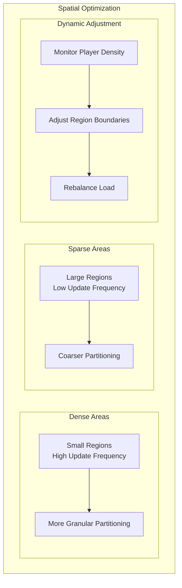

# Performance and Optimization Guide

This guide provides detailed strategies for optimizing Horizon game server performance, based on real-world profiling data and production deployment experience. The architecture's async-first design and plugin isolation enable sophisticated optimization techniques while maintaining system stability.

## Performance Monitoring and Metrics

### Built-in Monitoring System

Horizon includes comprehensive performance monitoring through the `HorizonMonitor` system implemented in `crates/horizon_event_system/src/monitoring.rs`:

```rust
// Create a performance monitor with GORC integration
let monitor = HorizonMonitor::with_gorc(event_system.clone(), gorc_system.clone());

// Generate comprehensive system reports
let report = monitor.generate_report().await;
println!("System health: {:.2}%", report.system_health * 100.0);

// Check for performance alerts
let alerts = monitor.should_alert().await;
for alert in alerts {
    eprintln!("ALERT: {}", alert);
}
```

The monitoring system tracks:
- Event system throughput and latency
- GORC replication performance
- Memory usage patterns
- Network utilization
- Plugin execution times
- Connection health metrics

### Metrics Collection Infrastructure

The `MetricsCollector` in `crates/game_server/src/health/metrics.rs` provides production-ready metrics:

```rust
use crate::health::metrics::MetricsCollector;

let metrics = MetricsCollector::new();

// Record server performance metrics
metrics.record_server_metrics(active_connections, memory_mb).await;

// Track event processing performance
metrics.record_duration("event_processing", async {
    process_events().await
}).await;

// Export metrics in Prometheus format
let prometheus_data = metrics.export_prometheus().await;
```

#### Key Metrics to Monitor

**System-Level Metrics:**
```rust
// Track these core metrics for production monitoring
metrics.set_gauge("server_active_connections", connections as f64).await;
metrics.set_gauge("server_memory_usage_mb", memory_mb as f64).await;
metrics.increment_counter("events_processed_total", event_count).await;
metrics.record_histogram("event_processing_duration", duration).await;
```

**Performance Thresholds:**
- Event processing latency: < 1ms for critical channels
- Memory usage: < 80% of allocated heap
- Connection utilization: < 90% of max connections
- GORC replication lag: < 16ms (one frame at 60 FPS)

## Event System Optimization

### Handler Performance Patterns

The event system's O(1) handler lookup provides consistent performance, but handler implementation significantly impacts throughput:

```rust
// ❌ Inefficient: Blocking I/O in handler
events.on_client("movement", "update", |event: MovementEvent| {
    // Don't do this - blocks event processing
    let player_data = database.load_player(event.player_id)?; // Blocking!
    update_position(player_data, event.position);
    Ok(())
}).await?;

// ✅ Efficient: Async processing with caching
events.on_client("movement", "update", |event: MovementEvent| {
    // Use cached data and async operations
    if let Some(player) = player_cache.get(&event.player_id) {
        player.update_position(event.position);
        // Queue database update for batch processing
        db_update_queue.push(player.clone());
    }
    Ok(())
}).await?;
```

### Batch Processing Techniques

For high-frequency events, implement batching to reduce overhead:

```rust
struct MovementPlugin {
    position_updates: Vec<PositionUpdate>,
    last_batch_time: Instant,
}

impl SimplePlugin for MovementPlugin {
    async fn register_handlers(&mut self, events: Arc<EventSystem>) -> Result<(), PluginError> {
        events.on_client("movement", "position", |event: MovementEvent| {
            // Accumulate updates instead of processing individually
            self.position_updates.push(PositionUpdate {
                player_id: event.player_id,
                position: event.position,
                timestamp: current_timestamp(),
            });
            
            // Process batch every 16ms (60 FPS)
            if self.last_batch_time.elapsed() > Duration::from_millis(16) {
                self.process_movement_batch().await?;
                self.position_updates.clear();
                self.last_batch_time = Instant::now();
            }
            Ok(())
        }).await?;
        Ok(())
    }
}
```

### Memory Pool Management

Reduce allocation overhead for frequently used objects:

```rust
use std::sync::Arc;
use tokio::sync::Mutex;

struct EventPool<T> {
    pool: Arc<Mutex<Vec<T>>>,
    factory: fn() -> T,
}

impl<T> EventPool<T> {
    async fn get(&self) -> T {
        let mut pool = self.pool.lock().await;
        pool.pop().unwrap_or_else(|| (self.factory)())
    }
    
    async fn return_object(&self, obj: T) {
        let mut pool = self.pool.lock().await;
        if pool.len() < 1000 { // Prevent unbounded growth
            pool.push(obj);
        }
    }
}

// Usage in high-frequency event handlers
let position_pool = EventPool::new(|| PositionUpdate::default());

events.on_client("movement", "update", |event: MovementEvent| {
    let mut update = position_pool.get().await;
    update.player_id = event.player_id;
    update.position = event.position;
    
    process_position_update(&update).await?;
    position_pool.return_object(update).await;
    Ok(())
}).await?;
```

## GORC System Optimization

### Channel Configuration

The GORC system's multi-channel architecture enables fine-tuned optimization:

```rust
// From gorc/mod.rs - Channel frequency guidelines
// Channel 0 (Critical): 30-60Hz updates - Player positions, combat
// Channel 1 (Detailed): 15-30Hz updates - Animations, interactions  
// Channel 2 (Cosmetic): 5-15Hz updates - Environmental effects
// Channel 3 (Metadata): 1-5Hz updates - Static information
```

**Optimal Channel Usage:**
```rust
// Register objects on appropriate channels based on update frequency needs
let player = ExamplePlayer::new();
gorc_system.register_object_on_channel(player, 0, position).await; // Critical updates

let environment_effect = EnvironmentEffect::new();
gorc_system.register_object_on_channel(environment_effect, 2, position).await; // Cosmetic
```

### Spatial Partitioning Tuning

The GORC spatial system can be tuned for different game world characteristics:



```rust
// Configure spatial partitioning based on world characteristics
let spatial_config = SpatialConfig {
    min_region_size: 100.0,  // Smaller for dense areas
    max_region_size: 1000.0, // Larger for sparse areas
    split_threshold: 50,     // Objects per region before splitting
    merge_threshold: 10,     // Objects per region before merging
};

gorc_system.configure_spatial_partitioning(spatial_config).await;
```

### Network Optimization

The GORC network engine includes several optimization features:

```rust
// Enable compression for bandwidth-limited environments
let network_config = NetworkConfig {
    enable_compression: true,
    compression_threshold: 512, // Compress messages > 512 bytes
    batch_size: 32,            // Batch up to 32 updates per packet
    max_batch_delay: Duration::from_millis(16), // 60 FPS max delay
};

gorc_system.configure_network(network_config).await;
```

## Plugin Performance Optimization

### Hot Path Identification

Use the built-in profiling to identify performance bottlenecks:

```rust
// Profile plugin performance
struct ChatPlugin {
    metrics: Arc<MetricsCollector>,
}

impl SimplePlugin for ChatPlugin {
    async fn register_handlers(&mut self, events: Arc<EventSystem>) -> Result<(), PluginError> {
        let metrics = self.metrics.clone();
        
        events.on_client("chat", "message", move |event: ChatEvent| {
            // Time critical operations
            metrics.record_duration("chat_message_processing", async {
                // Message validation
                let validation_time = Instant::now();
                validate_message(&event.message)?;
                metrics.record_histogram("chat_validation_time", 
                    validation_time.elapsed().as_secs_f64()).await;
                
                // Broadcast to recipients
                let broadcast_time = Instant::now();
                broadcast_message(&event).await?;
                metrics.record_histogram("chat_broadcast_time",
                    broadcast_time.elapsed().as_secs_f64()).await;
                
                Ok(())
            }).await
        }).await?;
        Ok(())
    }
}
```

### Async Best Practices

Optimize async operations to prevent blocking:

```rust
// ❌ Sequential processing - slow
async fn process_player_actions(actions: Vec<PlayerAction>) -> Result<(), Error> {
    for action in actions {
        validate_action(&action).await?;  // Blocks other actions
        apply_action(&action).await?;     // Sequential processing
    }
    Ok(())
}

// ✅ Concurrent processing - fast
async fn process_player_actions_optimized(actions: Vec<PlayerAction>) -> Result<(), Error> {
    use futures::future::try_join_all;
    
    // Process all actions concurrently
    let futures = actions.into_iter().map(|action| async move {
        validate_action(&action).await?;
        apply_action(&action).await?;
        Ok(())
    });
    
    try_join_all(futures).await?;
    Ok(())
}
```

### Resource Management

Implement proper resource cleanup and limits:

```rust
struct ResourceManagedPlugin {
    active_connections: Arc<AtomicUsize>,
    max_connections: usize,
}

impl SimplePlugin for ResourceManagedPlugin {
    async fn register_handlers(&mut self, events: Arc<EventSystem>) -> Result<(), PluginError> {
        let active_connections = self.active_connections.clone();
        let max_connections = self.max_connections;
        
        events.on_core("player_connected", move |event: PlayerConnectedEvent| {
            let current = active_connections.fetch_add(1, Ordering::SeqCst);
            
            // Implement connection limits
            if current >= max_connections {
                active_connections.fetch_sub(1, Ordering::SeqCst);
                return Err(EventError::HandlerExecution(
                    "Server at capacity".to_string()
                ));
            }
            
            println!("Player connected. Active: {}/{}", current + 1, max_connections);
            Ok(())
        }).await?;
        
        events.on_core("player_disconnected", move |_event: PlayerDisconnectedEvent| {
            let current = active_connections.fetch_sub(1, Ordering::SeqCst);
            println!("Player disconnected. Active: {}/{}", current - 1, max_connections);
            Ok(())
        }).await?;
        
        Ok(())
    }
}
```

## Network Layer Optimization

### Connection Pool Management

The network layer benefits from careful connection pool tuning:

```toml
# config.toml - Network optimization settings
[server]
bind_address = "0.0.0.0:8080"
max_connections = 10000        # Based on available memory
connection_timeout = 60        # Seconds before idle timeout
use_reuse_port = true         # Enable SO_REUSEPORT for Linux
tick_interval_ms = 16         # 60 FPS server tick rate

[server.security]
enable_rate_limiting = true
max_requests_per_minute = 120  # 2 requests per second per connection
max_message_size = 65536      # 64KB message limit
```

### Message Batching

Implement intelligent message batching to reduce network overhead:

```rust
struct MessageBatcher {
    pending_messages: HashMap<PlayerId, Vec<Message>>,
    last_flush: Instant,
    batch_timeout: Duration,
}

impl MessageBatcher {
    async fn add_message(&mut self, player_id: PlayerId, message: Message) {
        self.pending_messages.entry(player_id).or_default().push(message);
        
        // Flush if timeout exceeded or batch size reached
        if self.last_flush.elapsed() > self.batch_timeout || 
           self.pending_messages.values().any(|msgs| msgs.len() >= 32) {
            self.flush_all().await;
        }
    }
    
    async fn flush_all(&mut self) {
        for (player_id, messages) in self.pending_messages.drain() {
            if !messages.is_empty() {
                send_batched_messages(player_id, messages).await;
            }
        }
        self.last_flush = Instant::now();
    }
}
```

## Production Deployment Optimization

### Memory Management

Configure appropriate memory limits and monitoring:

```rust
// Monitor memory usage in production
async fn monitor_memory_usage(metrics: Arc<MetricsCollector>) {
    loop {
        if let Ok(memory_info) = get_memory_info() {
            metrics.set_gauge("memory_resident_mb", 
                memory_info.resident_mb as f64).await;
            metrics.set_gauge("memory_virtual_mb", 
                memory_info.virtual_mb as f64).await;
            
            // Alert if memory usage is high
            if memory_info.resident_mb > 8192 { // 8GB threshold
                eprintln!("WARNING: High memory usage: {}MB", memory_info.resident_mb);
            }
        }
        
        tokio::time::sleep(Duration::from_secs(30)).await;
    }
}
```

### CPU Optimization

Leverage Rust's performance characteristics:

```rust
// Use CPU affinity for consistent performance
#[cfg(target_os = "linux")]
fn set_cpu_affinity() -> Result<(), std::io::Error> {
    use libc::{cpu_set_t, sched_setaffinity, CPU_SET, CPU_ZERO};
    
    unsafe {
        let mut cpuset: cpu_set_t = std::mem::zeroed();
        CPU_ZERO(&mut cpuset);
        
        // Bind to specific CPU cores for predictable performance
        for cpu_id in 0..4 { // Use first 4 cores
            CPU_SET(cpu_id, &mut cpuset);
        }
        
        sched_setaffinity(0, std::mem::size_of::<cpu_set_t>(), &cpuset);
    }
    
    Ok(())
}
```

### Load Testing and Benchmarking

Implement comprehensive load testing:

```rust
#[cfg(test)]
mod performance_tests {
    use super::*;
    use std::time::Instant;
    
    #[tokio::test]
    async fn benchmark_event_throughput() {
        let events = create_horizon_event_system();
        let start = Instant::now();
        let event_count = 100_000;
        
        // Register a simple handler
        events.on_core("benchmark", |_event: serde_json::Value| Ok(())).await.unwrap();
        
        // Emit events as fast as possible
        for i in 0..event_count {
            events.emit_core("benchmark", &serde_json::json!({
                "id": i,
                "timestamp": current_timestamp()
            })).await.unwrap();
        }
        
        let duration = start.elapsed();
        let events_per_second = event_count as f64 / duration.as_secs_f64();
        
        println!("Event throughput: {:.0} events/second", events_per_second);
        assert!(events_per_second > 50_000.0, "Event system too slow");
    }
    
    #[tokio::test]
    async fn benchmark_gorc_replication() {
        let (events, mut gorc_system) = create_complete_horizon_system(
            Arc::new(MockServerContext)
        ).unwrap();
        
        let start = Instant::now();
        let object_count = 1000;
        
        // Register many objects
        for i in 0..object_count {
            let asteroid = ExampleAsteroid::new(
                Vec3::new(i as f32 * 10.0, 0.0, 0.0),
                MineralType::Iron
            );
            gorc_system.register_object(asteroid, 
                Vec3::new(i as f32 * 10.0, 0.0, 0.0)).await;
        }
        
        // Measure replication performance
        let tick_start = Instant::now();
        gorc_system.tick().await.unwrap();
        let tick_duration = tick_start.elapsed();
        
        println!("GORC tick with {} objects: {:?}", object_count, tick_duration);
        assert!(tick_duration < Duration::from_millis(16), "GORC tick too slow for 60 FPS");
    }
}
```

## Performance Tuning Checklist

### System-Level Optimizations

- **Event Handler Efficiency**: Keep handlers fast and non-blocking
- **Memory Pool Usage**: Reuse objects for high-frequency operations  
- **Batch Processing**: Group related operations to reduce overhead
- **Async Best Practices**: Use concurrent processing where possible
- **Resource Limits**: Implement proper bounds checking and cleanup

### GORC System Tuning

- **Channel Assignment**: Place objects on appropriate frequency channels
- **Spatial Configuration**: Tune region sizes for world characteristics
- **Network Settings**: Enable compression and batching for bandwidth optimization
- **Subscription Management**: Optimize player interest area calculations

### Production Configuration

- **Connection Limits**: Set appropriate max connections based on resources
- **Rate Limiting**: Configure request limits to prevent abuse
- **Monitoring Setup**: Deploy comprehensive metrics collection
- **Alert Thresholds**: Set up alerting for performance degradation
- **Load Testing**: Regular performance regression testing

The Horizon architecture's design enables these optimizations without sacrificing the modularity and maintainability that make the plugin system valuable. Regular profiling and monitoring ensure that performance optimizations remain effective as the system scales.